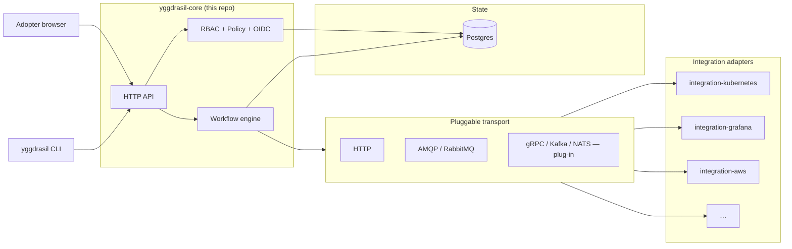
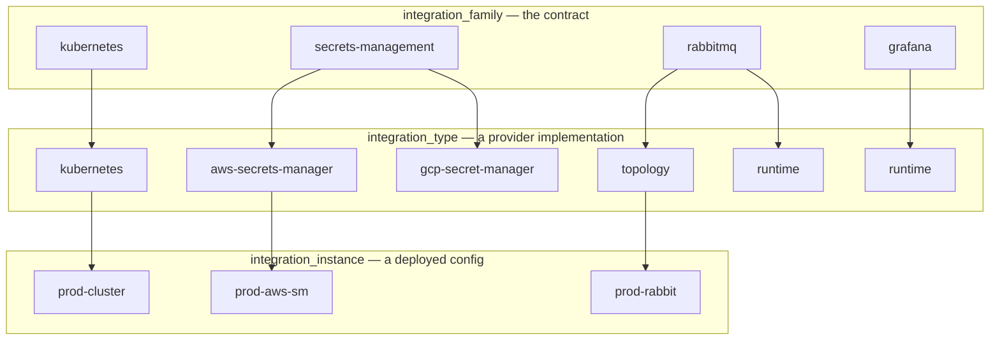

<div align="center">

# 🌳 Yggdrasil

**Self-hosted control plane for declarative workflows + integrations**

[](LICENSE)
[](go.mod)
[](https://github.com/dakasa-yggdrasil/yggdrasil-core/releases)
[](https://github.com/dakasa-yggdrasil/yggdrasil-core/pkgs/container/yggdrasil-core)
[](docs/getting-started.md)

*Run one command. Get a production-grade workflow engine with a versioned manifest catalog, RBAC, OAuth/OIDC, and a growing library of plug-in integrations.*

[Get started](#-quick-start) · [Concepts](docs/concepts.md) · [Architecture](docs/architecture.md) · [Catalog](docs/catalog.md) · [CLI reference](docs/cli.md)

</div>

---

## What is Yggdrasil?

Yggdrasil is the **self-hosted control plane** for teams that want declarative
workflows over their stack — without the lock-in of a SaaS or the assembly cost
of a custom platform. Think of it as **Backstage for orchestration**: a versioned
manifest catalog, a workflow engine, and a plug-in architecture for every
integration your team touches (Kubernetes, AWS, GCP, GitHub, Grafana, RabbitMQ,
Postgres, secrets managers, …).

You write YAML. Yggdrasil persists it, runs it, audits it.

```sh
yggdrasil init                                            # 1 command, fresh stack in ~1 minute
yggdrasil install dakasa-yggdrasil/integration-kubernetes # add an integration
yggdrasil apply -f my-workflow.yaml                       # ship a workflow
yggdrasil logs <run-id>                                   # stream the run
```

## How Yggdrasil fits in your stack

Yggdrasil is **not** a replacement for Backstage, Argo Workflows, Temporal,
Airflow, or the CI system you already run. It's a **manifest-first control
plane** that composes them. Every tool in your stack can be reached through
a Yggdrasil integration, and the orchestration layer is unified — same
RBAC, same policy, same audit trail — regardless of which engine actually
runs the job.

- **Backstage** — run its console as a Yggdrasil surface, or use Yggdrasil as
  a data source for Backstage plugins. The service catalog is yours; the
  workflows behind it are ours.
- **Argo Workflows** — register an `integration-argo` plugin; Yggdrasil
  steps dispatch pipelines to your existing Argo controller. Keep your
  K8s-native pipeline expertise.
- **Temporal** — an `integration-temporal` lets you use Temporal as the
  durable-execution backend for long-running Yggdrasil workflow steps.
- **Airflow / Dagster / n8n / Zapier** — compose, don't replace. A workflow
  step can trigger any of them via a thin integration adapter.
- **Crossplane / Terraform / Pulumi** — bring your IaC tool as an
  integration; Yggdrasil orchestrates when and how it runs.
- **GitHub Actions / GitLab CI** — ship an `integration-github-actions`
  that dispatches workflows with typed inputs; your CI stays unchanged.

The value Yggdrasil adds is the **connective layer**: versioned manifests,
declarative workflows, unified RBAC + policy, shared audit. The engines
that execute the actual work are a plug-in choice — yours.

## What you get

- 🧬 **Manifest-first catalog** — every integration, workflow, policy, RBAC
  role, auth provider, product, surface is a versioned YAML/JSON document
  in Postgres. Apply, diff, roll back by version.
- 🔌 **Pluggable integration adapters** — integrations speak a
  pluggable transport. HTTP and AMQP ship today; gRPC, Kafka, NATS,
  or any other fit as plug-ins. One command installs
  (`yggdrasil install`). One command scaffolds a new one
  (`yggdrasil new`). Details in
  [docs/features/transports.md](docs/features/transports.md).
- ⚙️ **Declarative workflows across everything** — DAG of steps over any
  integration family with template rendering, retry, per-step audit.
- 🛡 **Built-in RBAC + policy** — subject/action/resource allow-deny plus
  runtime-condition policy evaluation before every write.
- 🔐 **OAuth/OIDC edges** — GitHub, Google, custom OIDC configurable from
  YAML. Replace the login page as a surface.
- 📦 **Self-hosted, one-command bootstrap** — `yggdrasil init` brings up a
  full stack in ~1 minute. Promote to production Kubernetes with a
  manifest-first `yggdrasil deploy control-plane` (no Helm chart needed).

## Architecture at a glance



The control plane (this repo) is a single Go binary that exposes an HTTP
REST API. Integrations are independent adapters — they can talk to the
core through any transport the deployment enables. Two transports ship
today (`http_json` and `rabbitmq`); adding gRPC, Kafka, NATS, or any
other is a small, local switch-case extension — see
[docs/features/transports.md](docs/features/transports.md).

Install an integration with `yggdrasil install <repo>` and it appears
in your catalog as a usable operation set inside workflows, regardless
of which transport it chose.

## Feature deep-dives

Every feature below has a dedicated guide in [docs/features/](docs/features/)
with wire protocol, evaluation semantics, and runbooks.

- **[Manifests](docs/features/manifests.md)** — versioned, checksum-guarded,
  event-emitting documents that hold every piece of platform state.
- **[Workflows](docs/features/workflows.md)** — DAG engine with template
  rendering, retry, per-step audit, and three execution modes
  (integration, product, yggdrasil-local).
- **[Integrations](docs/features/integrations.md)** — family/type/instance/
  provider model, install flow, catalog labels.
- **[Transports](docs/features/transports.md)** — how the core reaches
  adapters: `http_json` and `rabbitmq` shipped, gRPC/Kafka/NATS as
  extensions.
- **[RBAC](docs/features/rbac.md)** and **[Policy](docs/features/policy.md)** —
  two-phase authorization with deny precedence, runtime condition operators,
  and full audit traces.
- **[Sessions + OAuth/OIDC](docs/features/sessions.md)** — password +
  third-party identity flows, state signing, auto-link by email.
- **[Events](docs/features/events.md)** — typed, transactionally emitted
  audit stream. Your outbox workers tail one table.
- **[Surfaces](docs/features/surfaces.md)** — replaceable UI/API edges that
  consume the core's contracts. Swap the console, add a custom admin
  dashboard, layer a nichado BFF.
- **[Products](docs/features/products.md)** — versioned bundles with
  renderer + target + reconcile for internal platform delivery.
- **[Secrets](docs/features/secrets.md)** — managed-secret rotation,
  `secret://` references, pluggable backends via integrations.

## 🚀 Quick start

> Need 10 minutes? Read [docs/getting-started.md](docs/getting-started.md).
> Want full theory first? Read [docs/concepts.md](docs/concepts.md).

### 1. Install the CLI

```sh
go install github.com/dakasa-yggdrasil/yggdrasil/cmd/yggdrasil@latest
```

Or grab a [tagged binary release](https://github.com/dakasa-yggdrasil/yggdrasil/releases).

### 2. Bootstrap (laptop / small VM)

```sh
yggdrasil init
```

This writes a `./yggdrasil/docker-compose.yml`, brings up Postgres + RabbitMQ + the core,
seeds the baseline integration catalog, creates an admin user, and saves a
context to `~/.yggdrasil/config.yaml`. Total time: ~1 minute on a warm
machine.

### 3. Add an integration

```sh
yggdrasil install dakasa-yggdrasil/integration-kubernetes --provider kubernetes
```

The CLI fetches the integration's quickstart, asks you for required inputs
(kubeconfig, namespace), and dispatches a workflow that materializes the
adapter pod plus the registered instance. After this, every workflow step
that says `family: kubernetes` resolves to the adapter you just installed.

### 4. Apply a workflow

```yaml
# my-workflow.yaml
apiVersion: yggdrasil.io/v1alpha1
kind: workflow
metadata:
  name: hello
  namespace: default
spec:
  trigger:
    mode: manual
  steps:
    - id: list-namespaces
      use:
        kind: integration
        family: kubernetes
        operation: observe_objects
      with:
        objects:
          - apiVersion: v1
            kind: Namespace
            metadata: { name: default }
```

```sh
yggdrasil apply -f my-workflow.yaml
yggdrasil get workflow
yggdrasil logs <run-id>
```

## Production deployment

Production install is **manifest-first** — there is no Helm chart to
template. You promote the seed (Compose) stack to a Kubernetes control
plane by writing a `control_plane` manifest and applying it through the
seed:

```yaml
# control-plane.yaml
apiVersion: yggdrasil.io/v1alpha1
kind: control_plane
metadata:
  name: primary
  namespace: global
spec:
  image: ghcr.io/dakasa-yggdrasil/yggdrasil-core:v1.0.0
  replicas: 2
  postgres:
    mode: external
    external:
      host: my-db.internal
      database: yggdrasil
      username: yggdrasil
      password_ref: secret://yggdrasil-db/password
      ssl_mode: require
  ingress:
    enabled: true
    host: yggdrasil.example.com
    class_name: nginx
  kubernetes:
    namespace: yggdrasil
    cluster_ref: { namespace: global, name: production-cluster }
```

```sh
yggdrasil deploy control-plane -f control-plane.yaml
```

The seed's `yggdrasil-deploy-control-plane` workflow renders the
Kubernetes objects (Deployment, Service, Ingress, optional bundled
Postgres) and applies them through the `integration-kubernetes` adapter,
running migrations via `integration-schema-migrations`. Every deploy knob
is a versioned, audited manifest field — not a `{{ .Values… }}` override.

Full guide: [docs/deployment.md](docs/deployment.md).

## Integration catalog

Curated, versioned, installable in one command. See
[docs/catalog.md](docs/catalog.md) for the full list and the schema each
integration exposes.

Every integration follows the same four-layer model — a **family**
(contract) implemented by one or more **types** (providers), each
deployed as one or more **instances**:



| Integration | Provider(s) | Install |
|---|---|---|
| **kubernetes** | client-go server-side apply | `yggdrasil install dakasa-yggdrasil/integration-kubernetes` |
| **aws** | S3, ECR, Secrets Manager, … | `yggdrasil install dakasa-yggdrasil/integration-aws` |
| **gcp** | Artifact Registry, Storage, Secret Manager | `yggdrasil install dakasa-yggdrasil/integration-gcp` |
| **github** | Workflows, repos, environments | `yggdrasil install dakasa-yggdrasil/integration-github` |
| **grafana** | Dashboards, datasources, alerts | `yggdrasil install dakasa-yggdrasil/integration-grafana` |
| **rabbitmq** | Topology + runtime + cluster install | `yggdrasil install dakasa-yggdrasil/integration-rabbitmq` |
| **schema-migrations** | goose / Postgres | `yggdrasil install dakasa-yggdrasil/integration-schema-migrations` |
| **secrets-management** | AWS Secrets Manager + GCP Secret Manager | `yggdrasil install dakasa-yggdrasil/integration-secrets-management` |
| **database-admin** | Postgres declarative DB / role / grant | `yggdrasil install dakasa-yggdrasil/integration-database-admin` |
| **manifest-sources** | Render a source location into K8s objects (kustomize) | `yggdrasil install dakasa-yggdrasil/integration-manifest-sources` |

### Build your own integration or surface

One command scaffolds a compilable, testable, publishable plugin:

```sh
yggdrasil new integration datadog --owner acme-eng
# ✓ scaffold ready
#   directory: ./integration-datadog
#   module:    github.com/acme-eng/integration-datadog
# Next: cd in, edit internal/adapter/spec.go, git commit, publish.
```

The scaffold clones the official
[integration-template](https://github.com/dakasa-yggdrasil/integration-template)
(or [surface-template](https://github.com/dakasa-yggdrasil/surface-template)
for a new surface), renames the module, initializes a fresh git repo, and
leaves you with a working adapter that passes `go test` on the spot. Push
to GitHub with a `vX.Y.Z` tag and the included GHA workflow publishes a
multi-arch image to `ghcr.io`. Any adopter can then install your
integration with one line:

```sh
yggdrasil install acme-eng/integration-datadog
```

Full walkthrough in [**docs/extending.md**](docs/extending.md) — 30
minutes from zero to published.

## Documentation

### 📖 Getting started
- [Getting started in 10 minutes](docs/getting-started.md)
- [Core concepts](docs/concepts.md)
- [Architecture](docs/architecture.md)

### 🔌 Feature deep-dives — [**docs/features/**](docs/features/)
- [Manifests](docs/features/manifests.md)
- [Workflows](docs/features/workflows.md)
- [Integrations](docs/features/integrations.md) · [Transports](docs/features/transports.md)
- [RBAC](docs/features/rbac.md) · [Policy](docs/features/policy.md)
- [Sessions & OAuth/OIDC](docs/features/sessions.md)
- [Events & audit](docs/features/events.md)
- [Surfaces](docs/features/surfaces.md) · [Products](docs/features/products.md) · [Secrets](docs/features/secrets.md)

### 🛠 Build your own — [**docs/extending.md**](docs/extending.md)
- `yggdrasil new integration <name>` — scaffold a plugin
- `yggdrasil new surface <name>` — scaffold a UI/edge
- [Integration catalog](docs/catalog.md) — what's already shipped
- [OAuth/OIDC provider templates](docs/auth-providers/)

### 🧩 Your stack — [**docs/ecosystem/**](docs/ecosystem/)
- [Yggdrasil + Backstage](docs/ecosystem/backstage.md)
- [Yggdrasil + Argo Workflows](docs/ecosystem/argo-workflows.md)
- [Yggdrasil + Temporal](docs/ecosystem/temporal.md)
- [Yggdrasil + Airflow / Dagster](docs/ecosystem/airflow.md)
- [Yggdrasil + IaC (Crossplane, Terraform, Pulumi)](docs/ecosystem/iac.md)
- [Yggdrasil + GitHub Actions / GitLab CI](docs/ecosystem/ci-cd.md)

### 🏗 Running in production — [**docs/operations/**](docs/operations/)
- [Deployment (Compose seed, `control_plane` to K8s, bare-metal)](docs/deployment.md)
- [Scaling](docs/operations/scaling.md)
- [Observability](docs/operations/observability.md)
- [Backup & restore](docs/operations/backup-restore.md)
- [Disaster recovery](docs/operations/disaster-recovery.md)
- [Performance tuning](docs/operations/performance-tuning.md)
- [Multi-environment](docs/operations/multi-environment.md)
- [Incident response](docs/operations/incident-response.md)
- [Security hardening](docs/operations/security-hardening.md)

### 📜 Policy & lifecycle
- [Versioning + deprecation policy](docs/versioning.md)
- [Upgrade runbook](docs/upgrade.md)
- [Security model + responsible disclosure](docs/security.md)
- [CLI reference](docs/cli.md)

## Project status

Yggdrasil is **self-hosted v1**: ready for teams that want a declarative
control plane on their own infrastructure. The HTTP API and `yggdrasil.io/
v1alpha1` manifest schemas follow the
[versioning + deprecation policy](docs/versioning.md). Adopters at this stage
should expect additive minor changes and breaking changes only behind a
bumped `apiVersion` with a deprecation window.

Roadmap:

- [x] Workflow engine + manifest catalog
- [x] CLI: init, login, apply, get, describe, logs, status, auth
- [x] Manifest-first deploy (`control_plane`) + Compose seed for self-hosted
- [x] OAuth/OIDC providers (GitHub, Google)
- [x] Baseline catalog seeded on first boot (k8s, aws, gcp, github, grafana, rabbitmq, schema-migrations, secrets-management, database-admin, manifest-sources)
- [ ] First-class web console
- [ ] Multi-tenant SaaS mode

## Contributing

PRs welcome. The full development guide is in
[CONTRIBUTING.md](CONTRIBUTING.md) (or
[AGENTS.md](AGENTS.md) if you came here from the agent-friendly side).

Discussions:
[GitHub Discussions](https://github.com/dakasa-yggdrasil/yggdrasil-core/discussions).

Security issues:
**security@dakasa.me** ([disclosure policy](docs/security.md#responsible-disclosure)).

## License

Apache 2.0 — see [LICENSE](LICENSE).

---

<div align="center">

Built with care by [Dakasa](https://dakasa.me) · Star ⭐ to follow releases

</div>
