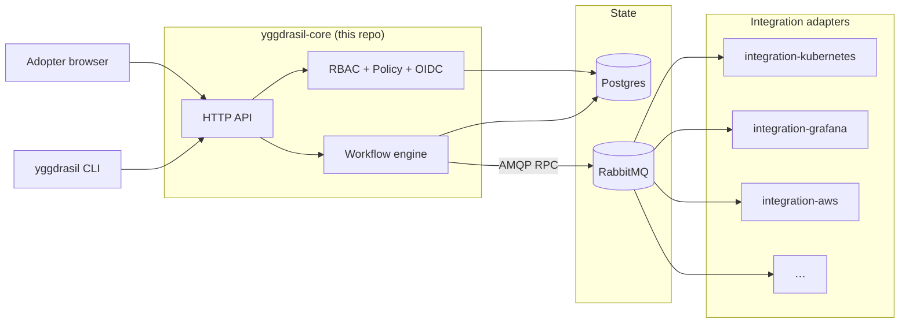

<div align="center">

# 🌳 Yggdrasil

**Self-hosted control plane for declarative workflows + integrations**

[](LICENSE)
[](go.mod)
[](https://github.com/dakasa-yggdrasil/yggdrasil-core/releases)
[](https://github.com/dakasa-yggdrasil/yggdrasil-core/pkgs/container/yggdrasil-core)
[](docs/getting-started.md)

*Run one command. Get a production-grade workflow engine with a versioned manifest catalog, RBAC, OAuth/OIDC, and a growing library of plug-in integrations.*

[Get started](#-quick-start) · [Concepts](docs/concepts.md) · [Architecture](docs/architecture.md) · [Catalog](docs/catalog.md) · [CLI reference](docs/cli.md)

</div>

---

## What is Yggdrasil?

Yggdrasil is the **self-hosted control plane** for teams that want declarative
workflows over their stack — without the lock-in of a SaaS or the assembly cost
of a custom platform. Think of it as **Backstage for orchestration**: a versioned
manifest catalog, a workflow engine, and a plug-in architecture for every
integration your team touches (Kubernetes, AWS, GCP, GitHub, Grafana, RabbitMQ,
Postgres, secrets managers, …).

You write YAML. Yggdrasil persists it, runs it, audits it.

```sh
yggdrasil init                                            # 1 command, fresh stack in ~1 minute
yggdrasil install dakasa-yggdrasil/integration-kubernetes # add an integration
yggdrasil apply -f my-workflow.yaml                       # ship a workflow
yggdrasil logs <run-id>                                   # stream the run
```

## Why Yggdrasil?

|   | Yggdrasil | Backstage | Argo Workflows | Temporal |
|---|---|---|---|---|
| **One-command bootstrap** | ✅ `yggdrasil init` | ❌ npx + manual setup | ❌ helm + CRDs | ❌ helm + db setup |
| **Versioned manifest catalog** | ✅ Postgres-backed, checksummed | ⚠️ catalog-only | ❌ | ❌ |
| **Declarative workflows in YAML** | ✅ | ❌ Plugins in TS | ✅ | ❌ Code-first |
| **First-class RBAC + policy engine** | ✅ | ⚠️ Permission framework | ❌ | ❌ |
| **Plug-in integrations from a catalog** | ✅ Install via 1 command | ✅ Plugin marketplace | ❌ | ❌ |
| **Self-hosted, OSS, no vendor account** | ✅ | ✅ | ✅ | ⚠️ |

## Architecture at a glance



The control plane (this repo) is a single Go binary. Integrations are
independent containers that speak an AMQP RPC contract — install one with
`yggdrasil install <repo>` and it appears in your catalog as a usable
operation set inside workflows.

## Features

### 🧬 Manifest-first
Every concept — workflow, integration, policy, RBAC, surface, product — is a
versioned YAML/JSON manifest. Apply with `yggdrasil apply -f`. Inspect with
`yggdrasil get`. Roll back by re-applying an earlier version. The catalog is
your source of truth.

### ⚙️ Workflow engine that composes integrations
Workflows are DAGs of steps. Each step picks a `family + operation` and the
engine resolves it to the right adapter at runtime, dispatches over AMQP,
retries with backoff, and renders templates from `inputs` + `metadata` +
previous step results.

### 🔌 Plug-in integrations via 1 command
`yggdrasil install dakasa-yggdrasil/integration-X` fetches the integration's
quickstart manifest, walks you through required inputs, and installs the
adapter into your cluster — Kubernetes ServiceAccount, Deployment,
broker secret, registered instance — in a single dispatched workflow.

### 🛡 Built-in RBAC + policy
First-class manifest kinds for `rbac` (roles, bindings, subject-action-resource)
and `policy` (rule-based runtime constraints with operators, dotted-key input,
deny-precedence). The authorization evaluator combines both before any write
lands; every decision is auditable.

### 🔐 OAuth/OIDC sign-in (GitHub, Google, custom OIDC)
Out-of-the-box providers configurable through `yggdrasil auth provider apply
-f`. State signing, callback handling, third-party identity linking, optional
auto-link by email. Adapter-friendly templates included for GitHub and Google.

### 📦 Production-ready packaging
Docker Compose for laptops + small self-hosted (`yggdrasil init`). Helm chart
with bundled Postgres + RabbitMQ subcharts (or external managed services) for
Kubernetes. Ingress, HPA, pod security, secret management — all opt-in via
`values.yaml`.

### 📡 Audit trail by design
Every state transition emits a typed event into Postgres in the same
transaction that wrote the state. `manifest.created`,
`workflow.run.succeeded`, `authorization.evaluated` — your audit pipeline
just tails one table.

## 🚀 Quick start

> Need 10 minutes? Read [docs/getting-started.md](docs/getting-started.md).
> Want full theory first? Read [docs/concepts.md](docs/concepts.md).

### 1. Install the CLI

```sh
go install github.com/dakasa-yggdrasil/yggdrasil/cmd/yggdrasil@latest
```

Or grab a [tagged binary release](https://github.com/dakasa-yggdrasil/yggdrasil/releases).

### 2. Bootstrap (laptop / small VM)

```sh
yggdrasil init
```

This writes a `./yggdrasil/docker-compose.yml`, brings up Postgres + RabbitMQ + the core,
seeds the baseline integration catalog, creates an admin user, and saves a
context to `~/.yggdrasil/config.yaml`. Total time: ~1 minute on a warm
machine.

### 3. Add an integration

```sh
yggdrasil install dakasa-yggdrasil/integration-kubernetes --provider kubernetes
```

The CLI fetches the integration's quickstart, asks you for required inputs
(kubeconfig, namespace), and dispatches a workflow that materializes the
adapter pod plus the registered instance. After this, every workflow step
that says `family: kubernetes` resolves to the adapter you just installed.

### 4. Apply a workflow

```yaml
# my-workflow.yaml
apiVersion: yggdrasil.io/v1alpha1
kind: workflow
metadata:
  name: hello
  namespace: default
spec:
  trigger:
    mode: manual
  steps:
    - id: list-namespaces
      use:
        kind: integration
        family: kubernetes
        operation: observe_objects
      with:
        objects:
          - apiVersion: v1
            kind: Namespace
            metadata: { name: default }
```

```sh
yggdrasil apply -f my-workflow.yaml
yggdrasil get workflow
yggdrasil logs <run-id>
```

## Production deployment

Use the included Helm chart for Kubernetes. The chart bundles Postgres + RabbitMQ
subcharts (Bitnami) and supports plugging in external managed instances:

```sh
helm dependency build chart
helm install yggdrasil chart \
  --namespace yggdrasil \
  --create-namespace \
  --set ingress.enabled=true \
  --set "ingress.hosts[0].host=yggdrasil.example.com" \
  --set ingress.className=nginx
```

Retrieve the auto-generated admin password:

```sh
kubectl get secret --namespace yggdrasil yggdrasil-yggdrasil-core-secrets \
  -o jsonpath='{.data.admin-password}' | base64 -d
```

Full guide: [docs/deployment.md](docs/deployment.md).

## Integration catalog

Curated, versioned, installable in one command. See
[docs/catalog.md](docs/catalog.md) for the full list and the schema each
integration exposes.

| Integration | Provider(s) | Install |
|---|---|---|
| **kubernetes** | client-go server-side apply | `yggdrasil install dakasa-yggdrasil/integration-kubernetes` |
| **aws** | S3, ECR, Secrets Manager, … | `yggdrasil install dakasa-yggdrasil/integration-aws` |
| **gcp** | Artifact Registry, Storage, Secret Manager | `yggdrasil install dakasa-yggdrasil/integration-gcp` |
| **github** | Workflows, repos, environments | `yggdrasil install dakasa-yggdrasil/integration-github` |
| **grafana** | Dashboards, datasources, alerts | `yggdrasil install dakasa-yggdrasil/integration-grafana` |
| **rabbitmq** | Topology + runtime + cluster install | `yggdrasil install dakasa-yggdrasil/integration-rabbitmq` |
| **schema-migrations** | goose / Postgres | `yggdrasil install dakasa-yggdrasil/integration-schema-migrations` |
| **secrets-management** | AWS Secrets Manager + GCP Secret Manager | `yggdrasil install dakasa-yggdrasil/integration-secrets-management` |
| **database-admin** | Postgres declarative DB / role / grant | `yggdrasil install dakasa-yggdrasil/integration-database-admin` |

### Build your own integration or surface

One command scaffolds a compilable, testable, publishable plugin:

```sh
yggdrasil new integration datadog --owner acme-eng
# ✓ scaffold ready
#   directory: ./integration-datadog
#   module:    github.com/acme-eng/integration-datadog
# Next: cd in, edit internal/adapter/spec.go, git commit, publish.
```

The scaffold clones the official
[integration-template](https://github.com/dakasa-yggdrasil/integration-template)
(or [surface-template](https://github.com/dakasa-yggdrasil/surface-template)
for a new surface), renames the module, initializes a fresh git repo, and
leaves you with a working adapter that passes `go test` on the spot. Push
to GitHub with a `vX.Y.Z` tag and the included GHA workflow publishes a
multi-arch image to `ghcr.io`. Any adopter can then install your
integration with one line:

```sh
yggdrasil install acme-eng/integration-datadog
```

Full walkthrough in [**docs/extending.md**](docs/extending.md) — 30
minutes from zero to published.

## Documentation

| Topic | Link |
|---|---|
| Getting started in 10 minutes | [docs/getting-started.md](docs/getting-started.md) |
| **Build your first plugin in 30 minutes** | [**docs/extending.md**](docs/extending.md) |
| Concepts (manifests, families, workflows) | [docs/concepts.md](docs/concepts.md) |
| Architecture deep-dive | [docs/architecture.md](docs/architecture.md) |
| Deployment (Compose, Helm, bare-metal) | [docs/deployment.md](docs/deployment.md) |
| CLI reference | [docs/cli.md](docs/cli.md) |
| OAuth/OIDC providers | [docs/auth-providers/](docs/auth-providers/) |
| Versioning + deprecation policy | [docs/versioning.md](docs/versioning.md) |
| Upgrade runbook | [docs/upgrade.md](docs/upgrade.md) |
| Security model + responsible disclosure | [docs/security.md](docs/security.md) |
| Integration catalog | [docs/catalog.md](docs/catalog.md) |

## Project status

Yggdrasil is **self-hosted v1**: ready for teams that want a declarative
control plane on their own infrastructure. The HTTP API and `yggdrasil.io/
v1alpha1` manifest schemas follow the
[versioning + deprecation policy](docs/versioning.md). Adopters at this stage
should expect additive minor changes and breaking changes only behind a
bumped `apiVersion` with a deprecation window.

Roadmap:

- [x] Workflow engine + manifest catalog
- [x] CLI: init, login, apply, get, describe, logs, status, auth
- [x] Helm chart + Compose for self-hosted
- [x] OAuth/OIDC providers (GitHub, Google)
- [x] 9-integration baseline catalog (k8s, aws, gcp, github, grafana, rabbitmq, schema-migrations, secrets-management, database-admin)
- [ ] First-class web console
- [ ] Multi-tenant SaaS mode

## Contributing

PRs welcome. The full development guide is in
[CONTRIBUTING.md](CONTRIBUTING.md) (or
[AGENTS.md](AGENTS.md) if you came here from the agent-friendly side).

Discussions:
[GitHub Discussions](https://github.com/dakasa-yggdrasil/yggdrasil-core/discussions).

Security issues:
**security@dakasa.me** ([disclosure policy](docs/security.md#responsible-disclosure)).

## License

Apache 2.0 — see [LICENSE](LICENSE).

---

<div align="center">

Built with care by [Dakasa](https://dakasa.me) · Star ⭐ to follow releases

</div>
