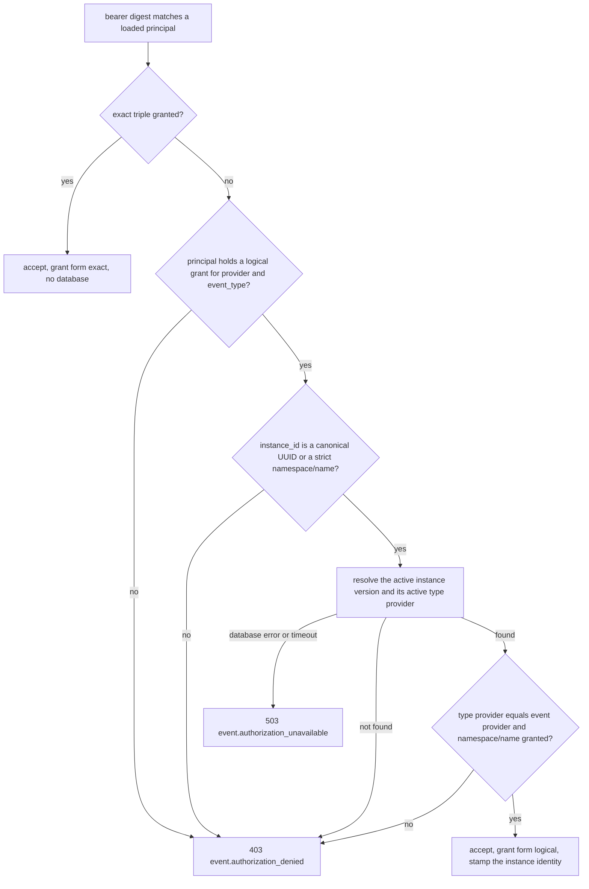

# ADR-0021: Key event publisher grants by the logical integration instance

- **Status:** Accepted
- **Date:** 2026-09-24
- **Deciders:** DaKasa Platform
- **Scope:** yggdrasil-core / event publisher authorization (`POST /api/v1/events`)
- **Supersedes:** none
- **Superseded by:** none

## Context

ADR-0017 scoped event publishers to exact `{provider,instance_id,event_type}`
triples, and Core compares `instance_id` as an opaque string. Adapters do not
agree on what they send there. Some send the per-version manifest UUID of the
`integration_instance`, some send the bare instance name, and one sends an
empty string. Every re-apply of an instance manifest creates a new row with a
new UUID, so a UUID grant dies the moment its instance is re-applied. An
instance that a cluster wake re-registers on every wake is the extreme case.
A dead grant turns fail-closed operations into ambiguous outcomes until an
operator regenerates the inventory and restarts Core. Bare names survive
re-applies but are not namespace-qualified.

The operator side of this decision is dakasa-system ADR-0280, which chose
resolution in Core over changing every adapter, regenerating UUID grants
automatically, or coarser per-type grants. It left the mechanism to Core
review: the error code, the reserved metadata keys and the provider check.
This ADR is that review. It refines ADR-0017 and does not supersede it: exact
grants keep their meaning and their database-free match.

## Decision

A grant's `instance_id` may name the logical integration instance as
`<namespace>/<name>`. The JSON shape of the inventory does not change. Core
decides a mutation event in this order:

1. **Two grant forms.** A grant whose `instance_id` contains no `/` is exact
   and lives in the exact map, compared as an opaque string, never touching
   the database. A grant containing `/` is logical, is parsed as exactly
   `<namespace>/<name>` (one `/`, both parts non-empty, lowercase, no
   whitespace, no wildcard characters, bounded length) and never lands in the
   exact map, so a literal `namespace/name` on the wire can never match
   without the database checks. A malformed logical grant refuses the whole
   inventory, as any other parse error already did.
2. **Duplicates.** Duplicates are checked after trimming, per form. An exact
   grant and its logical twin may coexist; the transition from UUID grants
   needs that.
3. **Exact first.** The exact match runs first and in memory. The logical
   path runs only after the bearer digest matched and only when the principal
   holds a logical grant for the event's provider and event type, so an
   anonymous or out-of-scope caller cannot make Core query.
4. **What resolves.** The event's `instance_id` resolves only when it is the
   canonical lowercase hyphenated UUID of any `integration_instance` version
   not yet purged, or a literal `<namespace>/<name>` accepted by the same
   strict parser. **A bare instance name on the wire is never resolved; it
   only matches an exact grant.** Uppercase, braced, URN and unhyphenated UUID
   spellings are not resolvable and never reach the database.
5. **What the resolved instance must satisfy.** The logical instance must have
   an active version. Its `spec.status` is not consulted, so a `disabled`
   instance with an active version is accepted. The `provider` of the active
   `integration_type` that the active version's `type_ref` points to must
   equal the event's `provider`, compared as-is with no normalization (an
   adapter whose event provider differs from its type provider keeps exact
   grants). The resolved namespace/name must then be one of the principal's
   logical grants for that provider and event type. The `type_ref` forms are
   the ones execution accepts, with one difference: the referenced type row
   must be the active one.
6. **Two lookups, not one.** dakasa-system ADR-0280 describes one lookup per
   logical event. The implementation does two indexed point lookups: the
   instance (primary key on the wire version, then
   `manifests_single_active_uidx` for the active version, or that index alone
   for a literal namespace/name) and the type provider. Both run under one
   3 second bound on the request context. Both are read-only.
7. **Errors.** Not found, not granted and wrong provider return one identical
   `403` body with code `event.authorization_denied` and one fixed detail, so
   the route cannot be used to probe the catalog. A database failure or
   timeout returns `503` with code `event.authorization_unavailable` and a
   fixed detail; the database error is logged, never echoed.
8. **Metadata.** Core drops every client-supplied metadata key under
   `yggdrasil.io/publisher_`, including keys this version does not stamp, then
   stamps the verified identity:

   | Key | Exact grant | Logical grant |
   |---|---|---|
   | `yggdrasil.io/publisher_machine_principal_id` | principal id | principal id |
   | `yggdrasil.io/publisher_grant_form` | `exact` | `logical` |
   | `yggdrasil.io/publisher_instance_namespace` | not set | instance namespace |
   | `yggdrasil.io/publisher_instance_name` | not set | instance name |
   | `yggdrasil.io/publisher_instance_manifest_id` | not set | id of the active version |
   | `yggdrasil.io/publisher_instance_version` | not set | version of the active version |

   `payload.instance_id` keeps what the adapter sent.
9. **Loading.** `New` parses the event publisher inventory and the legacy
   bridge settings once. The outer gate and the handler use that same parsed
   copy and never read those variables again; the bridge expiry is still
   evaluated per request. A refused inventory fails boot when
   `YGGDRASIL_ENV=production`, because `validateBootSecrets` already rejects
   it. When `YGGDRASIL_ENV` is unset (DaKasa production does not set it), a
   refused inventory is logged at error level and does not stop boot, because
   a Core that refuses to start takes the whole control plane down; every
   event publish then answers `401` until Core restarts with a valid
   inventory. A `Server` not built by `New` authenticates no event publisher
   and never falls into the anonymous development posture.
10. **Inventory checks.** `eventPublisherPrincipalDeclares` reports whether a
    parsed principal declares a grant in either form, without resolving
    anything, so an operator's CI can run Core's own parser over a rendered
    inventory and check every declared grant. Request authorization never
    uses it.

## Consequences

- Re-applying an instance manifest no longer requires an inventory write or a
  Core restart for publishers holding logical grants. Deleting the instance,
  or leaving it with no active version, revokes those grants with no restart.
- Recreating a deleted instance name under the same provider inherits its
  logical grants, so a hard delete must include a review of the grants that
  name it.
- An old-version UUID resolves only until the manifest purge removes that
  version (`MANIFEST_PURGE_RETENTION_DAYS`). Adapters receive the current UUID
  from Core on every call, so the exposure is small.
- Authorization of logical grants depends on the database. It fails closed
  with a `503` the adapter can retry. Exact grants keep working when the
  database is unavailable, although persisting the event needs it anyway.
- The provider check reads the live type provider, which the adapter describe
  auto-heal of ADR-0006 can rewrite. A provider rename in an adapter changes
  which events its instance's logical grants admit.
- A `type_ref.manifest_id` pinned to an inactive type version is denied, which
  is stricter than execution. No known instance uses that form.
- Core must run a build carrying this decision before any logical grant is
  written to the inventory: an older Core parses `namespace/name` as a literal
  exact grant that no adapter sends.
- A slash in an exact grant now means logical. No exact grant in use contains
  one.
- The unit job has no PostgreSQL. sqlmock pins the SQL text and the
  predicates it must carry, but it cannot prove the self-join semantics (an
  old version resolving to the active one, a tombstone, a hard delete, a kind
  mismatch). That proof needs a real database run.

## Related

- ADR-0017 (refines: exact event publisher triples stay; this adds the logical form)
- ADR-0006 (relates-to: auto-heal can rewrite the type provider the check reads)
- dakasa-system ADR-0280 (implements: the operator-side decision to resolve in Core)
