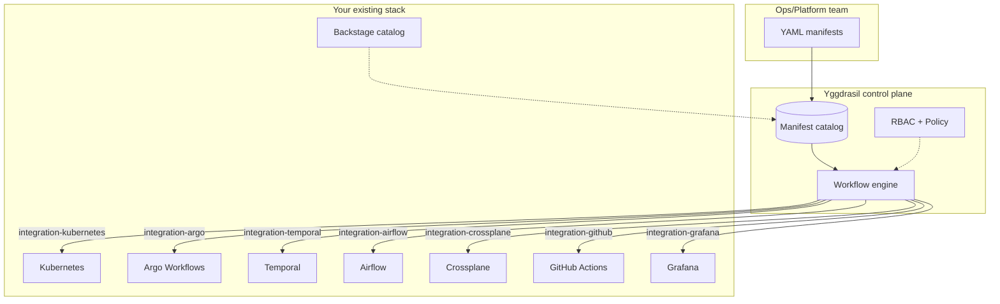

# Yggdrasil in your stack

Yggdrasil is a **manifest-first control plane**, not a workflow engine
for one ecosystem or an orchestrator for a specific cloud. It's meant to
sit alongside the tools your team already knows — Backstage for service
catalog, Argo for K8s-native pipelines, Temporal for durable execution,
Airflow for data workflows, Terraform for IaC, GitHub Actions for CI.

The question this directory answers is: *"I already run X. How does
Yggdrasil compose with it?"*

The short answer is **through integrations**. Each tool in your stack
exposes operations through an adapter (AMQP RPC); Yggdrasil dispatches
steps to the right adapter; your existing investment stays yours. The
value Yggdrasil adds is the layer above:

- A **versioned manifest catalog** that your tools can read and write.
- A **uniform RBAC + policy** checked before any dispatch, across every
  tool.
- A **typed event stream** of every transition, every tool, one table.
- A **CLI + TUI** (`yggdrasil install`, `yggdrasil new`) that onboards
  new integrations without custom glue per-team.

## The mental model

Your integrations dispatch out. Backstage optionally reads in. Everything
in between is just manifests.

## Per-tool guides

| Tool | How it composes |
|---|---|
| [Backstage](./backstage.md) | Surface + data source — Backstage stays your service catalog; Yggdrasil powers the automation behind each entity. |
| [Argo Workflows](./argo-workflows.md) | `integration-argo` — Yggdrasil steps dispatch Argo pipelines. Keep K8s-native pipeline expertise. |
| [Temporal](./temporal.md) | `integration-temporal` — Temporal as durable-execution backend for long-running Yggdrasil steps. |
| [Airflow / Dagster / n8n](./airflow.md) | Composition via integrations. Trigger from Yggdrasil, track as a step. |
| [Crossplane / Terraform / Pulumi](./iac.md) | IaC as integrations; Yggdrasil orchestrates *when* they run and with *what* inputs. |
| [GitHub Actions / GitLab CI](./ci-cd.md) | `integration-github` / `integration-gitlab` — CI stays where it is, Yggdrasil is the glue. |

## What Yggdrasil is NOT

- **Not a replacement for your orchestrator.** Argo runs K8s-native
  pipelines faster than we would. Temporal owns durable execution better.
  We dispatch to them.
- **Not a CI system.** Pipeline execution lives in Actions / GitLab /
  Buildkite. We call them from a workflow step.
- **Not a service catalog.** Backstage already nails that. We can be
  your underlying automation or a data source, not the replacement.
- **Not a monitoring stack.** Grafana / Prometheus / Loki stay where they
  are. `integration-grafana` is an edge, not a re-implementation.

## When Yggdrasil is the right tool

You benefit from Yggdrasil when you have:

- **Multiple orchestrators** and no single pane of glass across them.
- **Multiple environments** (dev / staging / prod / tenant-A / tenant-B)
  where manifests should live once and apply per context.
- **Ad-hoc governance** (RBAC + policy) that's currently bolted on per
  tool instead of declared once.
- **Integration sprawl** — glue scripts per team instead of a catalog of
  reusable adapters.

You don't benefit much if you:

- Only use one orchestrator and your team is already fluent in it.
- Have a tiny surface (one service, one pipeline, one environment).
- Already have a mature internal platform that plays this role.

The honest heuristic: if you keep writing "little automation on top of
X" and then "another little automation on top of Y", Yggdrasil is the
layer those would otherwise accumulate into.
