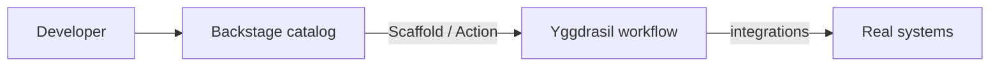

# Yggdrasil + Backstage

> TL;DR: Backstage remains your service catalog and UX front door.
> Yggdrasil becomes the automation layer behind it. They compose in
> both directions.

[Backstage](https://backstage.io) solves "where is everything we own
and who maintains it". Yggdrasil solves "what's the declarative way to
orchestrate changes across everything you own". They answer adjacent
questions and work well together.

## Composition patterns

There are three ways these two systems coexist, each valid depending
on where your team already invested.

### 1. Backstage in front, Yggdrasil behind (most common)

Backstage owns the catalog UI and the "which service is this" query.
Actions the user takes in Backstage — "deploy this service",
"rotate this secret", "run this remediation" — delegate to a workflow
in Yggdrasil. The user stays in Backstage; the orchestration happens
in Yggdrasil.



**How to wire it up:**

- In your Backstage `scaffolder` template, add a
  [`http:backstage:request`](https://backstage.io/docs/features/software-templates/writing-custom-actions)
  action that POSTs a `workflow.run` to Yggdrasil.
- Use a dedicated Yggdrasil collaborator + token for Backstage,
  stored in Backstage's secret config.
- The workflow you trigger is a regular Yggdrasil `workflow` manifest
  — scaffolded with `yggdrasil new` isn't needed, you just `apply -f`
  the workflow YAML in source control.

### 2. Yggdrasil in front, Backstage as data source

Your service catalog and repository bindings are declared as
Yggdrasil manifests (`repository_binding`, `product`, `surface`).
Backstage consumes these through an
[`EntityProvider` plugin](https://backstage.io/docs/features/software-catalog/external-integrations)
that reads from `/api/v1/products` and friends.

This is useful when:

- Your catalog is **derived** (from infra, from billing, from CMDB) and
  you want the canonical version in a versioned manifest store.
- Multiple tools need the same catalog — Yggdrasil becomes the
  authoritative source, Backstage (and the Yggdrasil console) both
  render it.

### 3. Replace the Backstage console entirely with a Yggdrasil surface

The first-party [`surface-console`](https://github.com/dakasa-yggdrasil/surface-console)
gives you a web console that talks directly to the Yggdrasil core API.
For teams that want a single product instead of two apps, this is the
simplest setup — but you lose Backstage's plugin ecosystem, which is
the main reason most teams keep Backstage.

## Wiring example: a deploy workflow from a Backstage scaffolder template

```yaml
# Backstage template.yaml (scaffolder)
apiVersion: scaffolder.backstage.io/v1beta3
kind: Template
metadata:
  name: deploy-via-yggdrasil
  title: Deploy <service> through Yggdrasil
spec:
  parameters:
    - title: Deploy
      properties:
        service: { type: string, title: Service name }
        ref:     { type: string, title: Git ref to deploy }
  steps:
    - id: dispatch
      name: Dispatch Yggdrasil workflow
      action: http:backstage:request
      input:
        method: POST
        url: 'https://yggdrasil.internal/api/v1/workflow-runs'
        headers:
          Authorization: Bearer ${{ secrets.YGGDRASIL_TOKEN }}
        body:
          workflow: { namespace: global, name: service-deploy }
          inputs:
            service: ${{ parameters.service }}
            ref:     ${{ parameters.ref }}
```

The corresponding Yggdrasil workflow lives in source as a `workflow`
manifest — one author writes the YAML, everyone can run it from
Backstage.

## What each system stays best at

| Concern | Stays in Backstage | Stays in Yggdrasil |
|---|---|---|
| Service catalog + ownership | ✅ | — |
| TechDocs | ✅ | — |
| Scaffolder / template | ✅ | — |
| Plugin-driven UI discovery | ✅ | — |
| Declarative workflow manifest | — | ✅ |
| Integration catalog + installs | — | ✅ |
| RBAC + policy evaluation | — | ✅ |
| Audit stream of platform ops | — | ✅ |
| OAuth/OIDC for automation tokens | — | ✅ |

## Pitfalls to avoid

- **Don't duplicate ownership.** Pick one catalog source of truth
  (Backstage OR Yggdrasil) for each entity kind; don't maintain two
  parallel lists.
- **Don't push Backstage into workflow execution.** Scaffolder is great
  for "kick off a flow"; bad for "run a 10-step DAG with retries and
  manual approvals". That's what Yggdrasil workflows exist for.
- **Don't skip auth.** Issue Backstage a named Yggdrasil collaborator
  with scoped RBAC; never share a human's token.
