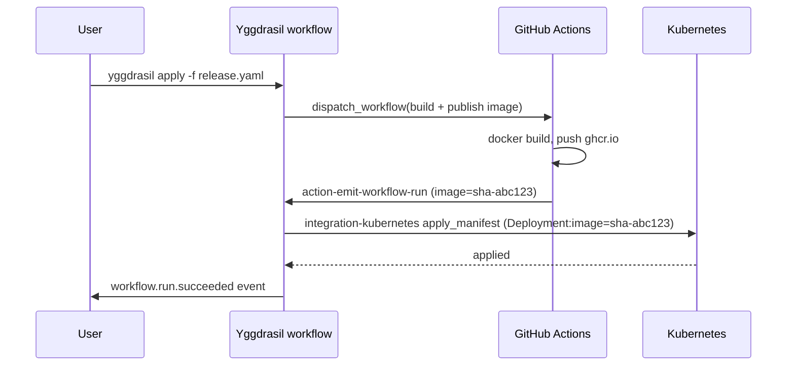

# Yggdrasil + GitHub Actions / GitLab CI / Buildkite

> TL;DR: Your CI runs where it runs. Yggdrasil dispatches CI jobs with
> typed inputs through `integration-github`, `integration-gitlab`, or a
> custom adapter — and receives completion events back so the rest of
> the workflow can continue.

CI is where your build artifacts come from. Yggdrasil is where your
platform workflows orchestrate from. The integration goes both ways:
Yggdrasil triggers CI, CI notifies Yggdrasil. Neither replaces the
other.

## Pattern 1 — Yggdrasil triggers CI

```yaml
- id: deploy
  use:
    kind: integration
    family: github
    operation: dispatch_workflow
  with:
    repository: my-org/my-service
    workflow: deploy.yml
    ref: main
    inputs:
      environment: "{{ inputs.env }}"
      image_tag: "{{ inputs.sha }}"
  retry:
    max_attempts: 1
  timeout_seconds: 1800
```

`integration-github` is shipped first-party
([docs](../catalog.md#github)). It dispatches and waits; the step
result carries the CI run URL + status.

The equivalent for GitLab CI would be a community
`integration-gitlab` using the
[pipelines REST API](https://docs.gitlab.com/ee/api/pipelines.html);
for Buildkite, a `integration-buildkite` using the
[pipelines API](https://buildkite.com/docs/apis/rest-api/pipelines).
Both scaffold in one command:

```sh
yggdrasil new integration gitlab --owner your-org
yggdrasil new integration buildkite --owner your-org
```

## Pattern 2 — CI notifies Yggdrasil

When a pipeline finishes, it POSTs to Yggdrasil's
`/api/v1/workflow-runs` to kick off the "deploy produced an artifact,
now do X" flow. A ready-made GitHub Action does this:
[`dakasa-yggdrasil/action-emit-workflow-run`](https://github.com/dakasa-yggdrasil/action-emit-workflow-run).

GitHub Actions wire-up:

```yaml
# .github/workflows/deploy.yml
jobs:
  deploy:
    runs-on: ubuntu-latest
    steps:
      - uses: actions/checkout@v4
      - run: ./deploy.sh
      - uses: dakasa-yggdrasil/action-emit-workflow-run@v1
        with:
          core-url: ${{ secrets.YGGDRASIL_CORE_URL }}
          workflow-run-token: ${{ secrets.YGGDRASIL_WORKFLOW_MACHINE_TOKEN }}
          workflow-namespace: global
          workflow-name: post-deploy-notify
          inputs-json: |
            {
              "service": "${{ github.repository }}",
              "sha": "${{ github.sha }}",
              "environment": "${{ inputs.environment }}"
            }
```

`YGGDRASIL_WORKFLOW_MACHINE_TOKEN` is the caller-side raw bearer; the core
stores only its SHA-256 digest in a machine-principal entry whose exact
workflow allowlist includes `global/post-deploy-notify`. Do not configure the
raw token in the core JSON and do not reuse it for another route family. The
target workflow must also declare `spec.authorization` whose RBAC grants the
machine subject `service:<principal_id>` action `run` on
`workflow:global:post-deploy-notify`.

The workflow allowlist does not constrain inputs by itself. If inputs can
select a repository, workflow file, ref, environment, secret reference, or
other execution target, keep that callback quarantined until a typed workflow
or its authorization policy binds those values exactly for the principal.
Core intentionally ships no default-on generic deploy emitter.

For GitLab, an equivalent snippet using `curl` in the
`.gitlab-ci.yml` `after_script`. For Buildkite, a plugin.

## Bidirectional: deploy flow

A realistic combined flow:



The platform team authors one Yggdrasil workflow that is deliberately
minimal: dispatch CI, wait for notification, apply to k8s. CI stays in
the service repo; orchestration stays in the catalog.

## Long-running pipelines

CI pipelines can take an hour. Two patterns:

### Fire-and-forget with callback

Yggdrasil step completes as soon as the dispatch succeeds. The flow
continues *asynchronously* when CI calls back via
`/api/v1/workflow-runs`. Best for parallel fan-out.

### Wait-for-completion

Yggdrasil step blocks until the CI run finishes. Simpler mental
model, but needs a `timeout_seconds` >= your longest pipeline. Set
retries to 1 on this step — CI retries come from the CI side, not
from Yggdrasil.

Choose by use case; both are supported.

## Pitfalls to avoid

- **Don't re-run CI from Yggdrasil retries.** A Yggdrasil retry will
  try to re-dispatch the CI workflow, which creates duplicate runs.
  `retry.max_attempts: 1` on CI-dispatching steps.
- **Don't leak CI tokens into the catalog.** Tokens that can trigger
  CI or read repo secrets must live as managed secrets in
  Yggdrasil, injected at call time via `credentials_ref`. Never
  inline.
- **Match the callback identity to the workflow.** When CI calls back, use a
  short-lived machine bearer whose server-side principal has an exact
  namespace/name workflow allowlist, and grant its `service:<principal_id>`
  subject through the workflow's required `spec.authorization` — not a global
  or human credential.
- **Keep the workflow minimal.** "Yggdrasil workflows that re-
  implement CI" is the most common anti-pattern. If the step is
  "run tests and then build an image", do it in the CI tool; don't
  compose 15 Yggdrasil steps that do the same thing.
