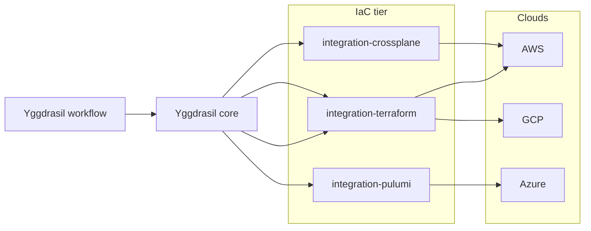

# Yggdrasil + Crossplane / Terraform / Pulumi

> TL;DR: IaC tools are the *how* for provisioning; Yggdrasil is the
> *when* + *with what inputs* + *by whom*. Register each IaC engine as
> an integration and your platform gets uniform governance over every
> resource the team provisions, regardless of which tool created it.

[Crossplane](https://crossplane.io),
[Terraform](https://www.terraform.io),
[Pulumi](https://www.pulumi.com) — different programming models, same
job: declarative cloud resources. Each team picks one for reasons that
don't need to become a platform decision. Yggdrasil makes them all look
like "a platform operation" from the outside.

## Pattern: IaC as a family of integrations



The workflow step doesn't know which IaC tool runs the job — it picks a
family (`iac` or a specific one like `crossplane`), passes a spec
payload, and the adapter handles the specifics.

## Crossplane

Crossplane is the most natural fit because it's already Kubernetes-native
and declarative. The integration is thin:

| Operation | Purpose |
|---|---|
| `apply_composition` | Apply a Crossplane Composition / XRD. |
| `apply_claim` | Apply a Claim CR to trigger provisioning. |
| `observe_managed_resource` | Read live state of a managed resource. |

```yaml
- id: provision-rds
  use:
    kind: integration
    family: crossplane
    operation: apply_claim
  with:
    cluster:
      instance_ref: { name: control-plane-cluster, namespace: global }
    claim:
      apiVersion: database.example.com/v1alpha1
      kind: PostgreSQLInstance
      metadata:
        name: "{{ inputs.service }}-db"
        namespace: platform
      spec:
        parameters:
          storageGB: 20
        compositionSelector:
          matchLabels: { provider: aws }
```

In practice this can be done entirely through `integration-kubernetes`
(since Crossplane Claims are just CRs). A dedicated
`integration-crossplane` only pays off when you want typed operations
for Crossplane-specific concerns (drift detection, forced-reconcile).

## Terraform

Terraform is procedural and stateful — the integration has to decide
where state lives and how to serialize concurrent runs.

### Pattern A — module per workspace, Terraform Cloud / Enterprise backend

| Operation | Purpose |
|---|---|
| `trigger_run` | Create a run in the configured workspace with queued inputs. |
| `describe_run` | Fetch state + plan output + apply result. |
| `cancel_run` | Cancel a queued/running run. |
| `destroy_run` | Trigger destroy plan. |

The state is Terraform Cloud's concern; the adapter just dispatches.

### Pattern B — runner per call, self-managed state

The adapter itself runs `terraform init / plan / apply` in a
sandboxed pod per call. State backend (S3 + DynamoDB lock, GCS, etc.)
is configured on the integration_instance. Good for small shops; scales
worse than Pattern A.

Pick exactly one — mixing them leads to "who holds the lock" bugs.

## Pulumi

Pulumi is code (TS/Python/Go/C#) so the adapter pattern diverges:
trigger a Pulumi stack update via the Pulumi Service API, or in a
sandboxed runner pod.

| Operation | Purpose |
|---|---|
| `pulumi_up` | Run `pulumi up` for a stack with config overrides. |
| `pulumi_preview` | `pulumi preview` only, for approval flows. |
| `pulumi_destroy` | Destroy a stack. |
| `describe_stack` | Stack outputs + last update. |

Pulumi + Yggdrasil pairs nicely with Heimdall-style approval gates:
preview → human approval manifest → up. The approval manifest lives
in Yggdrasil; the IaC runs where it always did.

## Uniform governance, regardless of engine

Because every IaC call goes through a Yggdrasil integration, every
call gets:

- **RBAC** — only authorized subjects can trigger `pulumi_up` or
  `apply_claim`.
- **Policy** — runtime conditions can block `apply_claim` on prod
  outside business hours, demand `apply_destroy` to go through an
  approval workflow, etc.
- **Audit** — one table shows every resource provisioned, across
  every IaC tool, in order.
- **Catalog** — `integration_type` manifests are the single source of
  truth for "which cloud accounts / clusters / Pulumi organizations
  are reachable from this platform".

## Pitfalls to avoid

- **Don't run Yggdrasil as your IaC engine.** The core is not a
  substitute for Terraform or Pulumi. Stay in their lanes.
- **State is their problem, not yours.** Never try to track IaC state
  inside Yggdrasil manifests — the IaC tool already does. Store
  *references* (workspace ID, stack name), not mirrored state.
- **Approval coupling.** If you wire IaC through a Yggdrasil approval
  gate, the adapter must handle the "plan passed, apply skipped due
  to rejection" case cleanly — record both outcomes, don't just
  blackhole the run.
- **Secrets.** IaC engines consume cloud credentials aggressively.
  Inject via Yggdrasil managed secrets → pass to the adapter as
  environment for the run. Never materialize them into manifest
  payloads.
