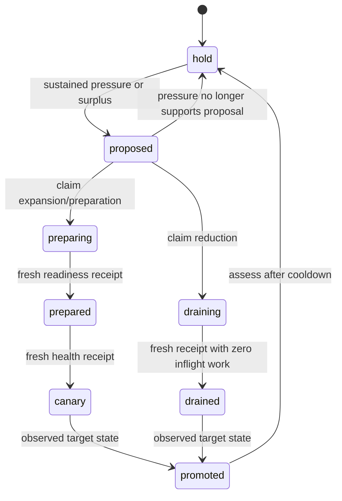

# Bounded capacity intents

`capacity_policy` is a provider-neutral planning contract. It is stored through
the generic manifest API and bound to one active logical workflow. No new
scheduler, privileged self-dispatch path, provider credentials or background
actuator is introduced. Both execution switches default to disabled.

## Scope and decisions

The durable key is `(namespace, environment, domain, dimension)`. Another policy
cannot own the same key. `target_identity` and `owner` identify the observed
resource; resource/workload UIDs guard replacement. Workload resource-version
changes reset hysteresis and invalidate unclaimed plans. Each signal declares a
source and unit. All required signals must be present. Any signal with sustained
high pressure can request expansion; every signal must show sustained surplus
for reduction. Window `range_min` proves sustained expansion and `range_max`
proves sustained surplus. Coverage and gap declarations must come from the
workflow's metric collection, not constants supplied by an external caller.

The collector must use source scrape/sample timestamps (for example independent
`timestamp(selector)` observations), not an instant query's evaluation time.
Prometheus adapter `require_data=true`, `matched=true`, `data_state=present`,
finite values, units, counts, coverage and freshness are separate requirements.
Older adapters that omit the strict fields cannot satisfy this contract.

No data or invalid data produces `hold`, resetting pressure windows. The
exception is repairing a breached protected floor: a fresh, owned snapshot and
eligible profile permit expansion to the floor without demand telemetry. Health
and completion receipts still require the full metric contract. Missing data
never permits reduction.

Profiles declare provider, region, supported unit range, cost per unit in the
policy's single currency, dated quote and validation references, and preparation
time. Selection minimizes declared cost among eligible profiles. A profile's
minimum cannot exceed the requested count during ordinary scaling, so reduction
cannot turn into an oversized migration. Floor repair may use a larger validated
profile minimum; its total effective count is included in price comparison.
Quotes are operator data, not live availability guarantees
or automatic FX conversion. A profile change requests `prepare`; it never moves
traffic or data by itself. Forecasting and time-to-headroom can be additional
pressure signals, but this planner does not calculate a forecast.

## Protected workflow operations

All operations use `use.kind: yggdrasil` and require `spec.authorization`.
The existing authenticated dispatch, RBAC/policy and exact machine-principal
route/workflow grants apply. Runtime verifies the active workflow revision and
policy binding. The policy and workflow rows are checked again under transaction
locks before mutation. Actorless scheduler/reactor/AMQP dispatch remains rejected
for protected workflows.

| Operation | Required `with` values | Result metadata |
|---|---|---|
| `capacity.assess` | `policy: {namespace,name}`, `assessment` | Durable decision, phase and generation |
| `capacity.observe` | `policy` | Existing intent; SQL no-row is an error |
| `capacity.claim` | `policy`, `generation`, fresh `assessment` | Server-generated `lease_owner`, `fencing_token`, expiry |
| `capacity.renew` | `policy`, `generation`, `fencing_token`, `lease_owner` | Extended database-time lease |
| `capacity.advance` | Lease tuple, `phase`, `proof` | Persisted phase or error |
| `capacity.recover` | Original `policy` revision, `generation`, fresh `assessment` | Recovery-only fenced lease |
| `capacity.renew_recovery` | Original policy revision and recovery lease tuple | Extended recovery-only lease |
| `capacity.reconcile` | Original policy revision, lease tuple, `phase`, terminal `proof` | `reconciled`, `reconciled_partial` or `aborted` observed outcome |

Optional [durable provider mutation grants](capacity-mutations.md) add protected
`capacity.record_slot`, `capacity.grant_mutation` and `capacity.confirm_mutation`.
They require explicit approved slot bindings and a separate exact adapter
callback inventory. They do not enable an actuator or a scheduler.

`YGGDRASIL_CAPACITY_EXECUTION_ENABLED=true` and policy `execution_enabled=true`
are both required for normal claim, renewal and phase changes. Assessment works
in shadow mode. Recovery-only operations record already-started outcomes under
the exact protected workflow; they do not authorize fresh actuation.
`decision.execution_permitted` is eligibility under both switches,
not proof that a provider changed anything. Each lease is bound to a private
server-generated invocation UUID that inputs and metadata cannot supply.
`capacity.observe` hides the lease nonce, and another invocation cannot renew or
advance a live lease even if it knows the nonce. After a restart, recover through
lease expiry and a new fence. Workflow receipts and lease metadata belong to the
protected run and must not be published as public metrics.

`proof` contains `assessment`, `observed_at`, `receipt_ref`, `healthy` and
nonnegative `inflight`. A drained receipt additionally requires zero inflight
work; native HPA counts alone are insufficient. Promotion requires observed
profile and units equal to the decision. These proofs must be assembled by a
fixed trusted workflow from real observers and probes. Core validates their
contract; it cannot attest the truth of a misconfigured workflow's assertions.

## Concurrency, recovery and adapter boundary

PostgreSQL advisory and row locks serialize initial creation, assessments,
claims and phase changes. Repeated matching unclaimed proposals retain one
generation. An unclaimed proposal may be superseded safely. Ordinary claims
accept only unclaimed proposals. Once started, an expired lease can only obtain
a recovery-only epoch; it cannot reopen acquisition or normal phase advancement.
A generation remains outstanding until observed completion. Stale owners cannot
renew or advance it. Invalid/unknown provider outcomes remain unfinished; no automatic
resource deletion, rollback or claim of successful drain follows a timeout.

A fixed workflow must check/renew the lease immediately before provider writes,
use adapter UID/resource-version preconditions and a stable per-generation
idempotency key, and pass a monotonically increasing provider generation. Read
back before retrying an uncertain response. A Core lease and Kubernetes CAS are
not one distributed transaction. Fence workload replacement/configuration and
capacity changes in the same external operational controller. HPA bounds and
Deployment identity are two objects; there is no atomic two-object CAS.

Native Kubernetes `ensure_capacity_envelope` changes an allowlisted HPA's bounds,
with server-owned floor/ceiling and explicit adoption. It does not patch
Deployment replicas or generated HPAs. Its observer's UID/RV, workload UID/RV and
drift fields are diagnostics, not readiness, source freshness or drain proof.
The workflow must assemble those receipts independently. `snapshot.units` must
describe the precise controlled capacity variable, for example an HPA's maximum
bound, rather than whichever live replica count happens to be convenient. Its
meaning must remain fixed for the policy dimension. This Core protocol does not
yet install that workflow or enable an adapter instance.

Recovery is distinct from retrying provider mutations. `capacity.recover` can
bind the original immutable `policy.version`, even after a new revision becomes
active, and always returns `execution_permitted=false`. `capacity.reconcile`
records observed completion without asserting skipped readiness/canary phases
ran. `reconciled` requires the observed intended capacity; `aborted` additionally
requires the immutable baseline and explicit `no_mutation_verified`. Terminal
recovery requires `mutation_inflight=0` and `provider_fencing_token` equal to the
current recovery token. Business drain also requires zero business inflight.
A protected floor repair can reconcile with fresh snapshot-only evidence while
demand telemetry is absent, retaining all health, fencing and mutation-quiescence
requirements. This exception never authorizes reduction or certifies skipped
business/canary checks. Other reconciliation outcomes require the complete metric
contract. With Core mutation grants, `reconciled_partial` can close an interrupted
same-profile change at its actual observed capacity. It requires
`membership_complete:true` from a complete fixed native observer, actual units
inside both the original baseline/target interval and the protected envelope,
zero unresolved grants, and a matching freshly reread immutable slot ledger.
Recovery `capacity.record_slot` refreshes only existing exact tuples; it cannot
register or replace membership. Partial reconciliation preserves the original
decision and records its distinct terminal outcome, releases the recovery lease,
and allows a separately assessed new generation after cooldown. It does not
certify canary/promotion or permit another write under the recovery lease.
Other partial provider state remains unfinished and requires explicit repair.
A single GET, a lease timeout or an empty job queue does not prove provider
mutation quiescence. Obtain independent authoritative fencing/cancellation and
settlement receipts through the protected workflow before closing the generation.
Pass the Core fencing token as the adapter's generation; passing only the intent
generation would not fence lease recovery. These are workflow contract assertions,
not an automatic multi-provider cancellation engine.

`capacity_intent_events` records generation, fencing token, phase and public
receipt reference without lease bearer values. Policy revisions cannot replace an
outstanding generation. Reconcile it through its original immutable revision
with recovery-only authorization before planning under the new revision.

## Bounded historical retention

The `capacity_events_retention` addon is disabled unless the process explicitly
sets `YGGDRASIL_CAPACITY_EVENT_RETENTION_ENABLED=true`. It removes only expired
capacity event rows that have a matching current intent and are at least two
generations behind it. Current and immediately previous generations, orphan
history, and all authoritative intent/lease state remain retained. This protects
unfinished recovery and the most recent change history even past the time limit.

| Setting | Default when enabled | Accepted range |
|---|---|---|
| `YGGDRASIL_CAPACITY_EVENT_RETENTION_DAYS` | 90 days | 30..3650 days |
| `YGGDRASIL_CAPACITY_EVENT_RETENTION_BATCH` | 1000 rows | 1..1000 rows |
| `YGGDRASIL_CAPACITY_EVENT_RETENTION_INTERVAL_SECONDS` | 900 seconds | 60..86400 seconds |

Invalid enabled settings stop initialization. Each tick performs one batch with
a five-second context and `FOR UPDATE SKIP LOCKED`; replicas delete disjoint
event rows. There is no startup sweep or unbounded catch-up loop. Shutdown cancels
and joins the panic-safe worker. The existing time index supports expiration
selection, but protected long-lived generations may still dominate retained
history. Monitor table size and the sweep logs; retention is not a hard storage
cap. Choose the review horizon before enabling it. It does not collect, delete,
cancel or fence any provider resource and is independent of capacity execution.

## Acceptance and limitations

GitHub CI runs planner and manifest regressions, plus a PostgreSQL 16 protocol
gate with all production migrations, race detection and a no-skips receipt. It
proves concurrent assessment/claim, restart/readback, lease expiry/stale owner,
phase/promotion guards, shadow mode, active policy ownership and protected
workflow channel/revision checks. Historical retention runs against actual
PostgreSQL with overlapping replica batches, bounded deletion and exact live
intent/lease preservation assertions. It does not certify load capacity or provider
failover. Before activation, verify observer projections, fixed workflows,
native HPA ownership, source coverage, emergency pause, provider mutation/replay,
warm-up, canary routing, drain and rollback in a remote ephemeral environment.
