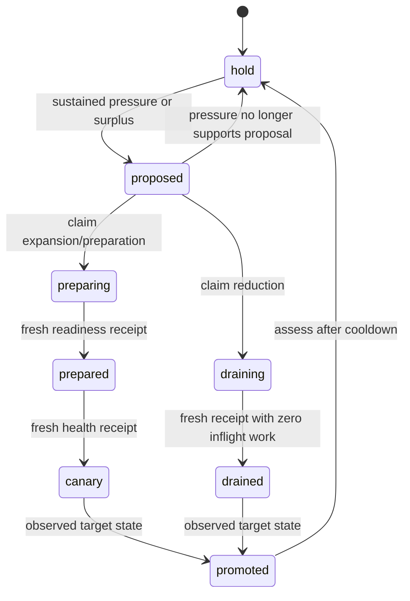

# Bounded capacity intents

`capacity_policy` is a provider-neutral planning contract. It is stored through
the generic manifest API and bound to one active logical workflow. No new
scheduler, privileged self-dispatch path, provider credentials or background
actuator is introduced. Both execution switches default to disabled.

## Scope and decisions

The durable key is `(namespace, environment, domain, dimension)`. Another policy
cannot own the same key. `target_identity` and `owner` identify the observed
resource; resource/workload UIDs guard replacement. Workload resource-version
changes reset hysteresis and invalidate unclaimed plans. Each signal declares a
source and unit. All required signals must be present. Any signal with sustained
high pressure can request expansion; every signal must show sustained surplus
for reduction. Window `range_min` proves sustained expansion and `range_max`
proves sustained surplus. Coverage and gap declarations must come from the
workflow's metric collection, not constants supplied by an external caller.

The collector must use source scrape/sample timestamps (for example independent
`timestamp(selector)` observations), not an instant query's evaluation time.
Prometheus adapter `require_data=true`, `matched=true`, `data_state=present`,
finite values, units, counts, coverage and freshness are separate requirements.
Older adapters that omit the strict fields cannot satisfy this contract.

No data or invalid data produces `hold`, resetting pressure windows. The
exception is repairing a breached protected floor: a fresh, owned snapshot and
eligible profile permit expansion to the floor without demand telemetry. Health
and completion receipts still require the full metric contract. Missing data
never permits reduction.

Profiles declare provider, region, supported unit range, cost per unit in the
policy's single currency, dated quote and validation references, and preparation
time. Selection minimizes declared cost among eligible profiles. A profile's
minimum cannot exceed the requested count, so reduction cannot turn into an
oversized migration. Quotes are operator data, not live availability guarantees
or automatic FX conversion. A profile change requests `prepare`; it never moves
traffic or data by itself. Forecasting and time-to-headroom can be additional
pressure signals, but this planner does not calculate a forecast.

## Protected workflow operations

All operations use `use.kind: yggdrasil` and require `spec.authorization`.
The existing authenticated dispatch, RBAC/policy and exact machine-principal
route/workflow grants apply. Runtime verifies the active workflow revision and
policy binding. The policy and workflow rows are checked again under transaction
locks before mutation. Actorless scheduler/reactor/AMQP dispatch remains rejected
for protected workflows.

| Operation | Required `with` values | Result metadata |
|---|---|---|
| `capacity.assess` | `policy: {namespace,name}`, `assessment` | Durable decision, phase and generation |
| `capacity.observe` | `policy` | Existing intent; SQL no-row is an error |
| `capacity.claim` | `policy`, `generation`, fresh `assessment` | Server-generated `lease_owner`, `fencing_token`, expiry |
| `capacity.renew` | `policy`, `generation`, `fencing_token`, `lease_owner` | Extended database-time lease |
| `capacity.advance` | Lease tuple, `phase`, `proof` | Persisted phase or error |

`YGGDRASIL_CAPACITY_EXECUTION_ENABLED=true` and policy `execution_enabled=true`
are both required for claim, renewal and phase changes. Assessment works in
shadow mode. `decision.execution_permitted` is eligibility under both switches,
not proof that a provider changed anything. Workflow receipts and lease metadata
belong to the protected run and must not be published as public metrics.

`proof` contains `assessment`, `observed_at`, `receipt_ref`, `healthy` and
nonnegative `inflight`. A drained receipt additionally requires zero inflight
work; native HPA counts alone are insufficient. Promotion requires observed
profile and units equal to the decision. These proofs must be assembled by a
fixed trusted workflow from real observers and probes. Core validates their
contract; it cannot attest the truth of a misconfigured workflow's assertions.

## Concurrency, recovery and adapter boundary

PostgreSQL advisory and row locks serialize initial creation, assessments,
claims and phase changes. Repeated matching unclaimed proposals retain one
generation. An unclaimed proposal may be superseded safely. Once claimed, a
generation remains outstanding until observed completion. Expired leases allow
recovery of that same generation with a new token. Stale owners cannot renew or
advance it. Invalid/unknown provider outcomes remain unfinished; no automatic
resource deletion, rollback or claim of successful drain follows a timeout.

A fixed workflow must check/renew the lease immediately before provider writes,
use adapter UID/resource-version preconditions and a stable per-generation
idempotency key, and pass a monotonically increasing provider generation. Read
back before retrying an uncertain response. A Core lease and Kubernetes CAS are
not one distributed transaction. Fence workload replacement/configuration and
capacity changes in the same external operational controller. HPA bounds and
Deployment identity are two objects; there is no atomic two-object CAS.

Native Kubernetes `ensure_capacity_envelope` changes an allowlisted HPA's bounds,
with server-owned floor/ceiling and explicit adoption. It does not patch
Deployment replicas or generated HPAs. Its observer's UID/RV, workload UID/RV and
drift fields are diagnostics, not readiness, source freshness or drain proof.
The workflow must assemble those receipts independently. This Core protocol
does not yet install that workflow or enable an adapter instance.

`capacity_intent_events` records generation, fencing token, phase and public
receipt reference without lease bearer values. Configure an operator-owned
retention job for this table before enabling continuous actuation; this patch
does not add a scheduled retention job. Never revise an unresolved policy while
provider work is uncertain. Recover under its original active revision first.

## Acceptance and limitations

GitHub CI runs planner and manifest regressions, plus a PostgreSQL 16 protocol
gate with all production migrations, race detection and a no-skips receipt. It
proves concurrent assessment/claim, restart/readback, lease expiry/stale owner,
phase/promotion guards, shadow mode, active policy ownership and protected
workflow channel/revision checks. It does not certify load capacity or provider
failover. Before activation, verify observer projections, fixed workflows,
native HPA ownership, source coverage, emergency pause, provider mutation/replay,
warm-up, canary routing, drain and rollback in a remote ephemeral environment.
