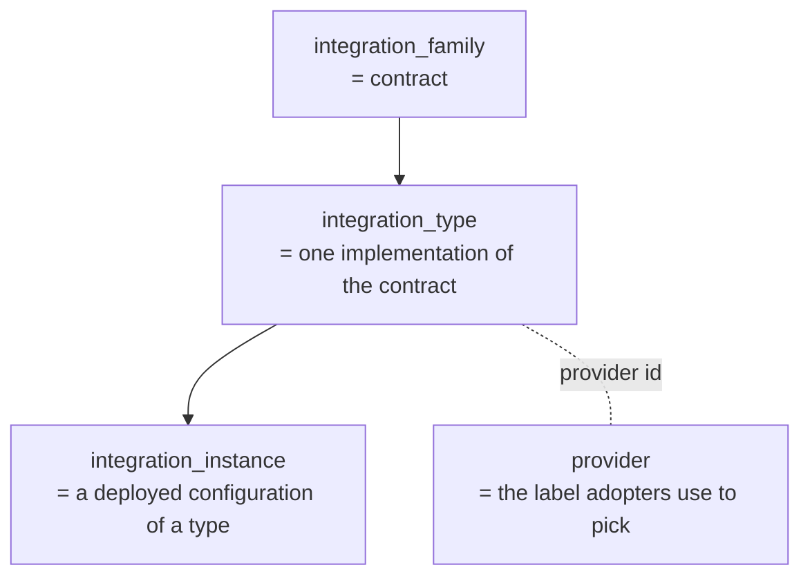
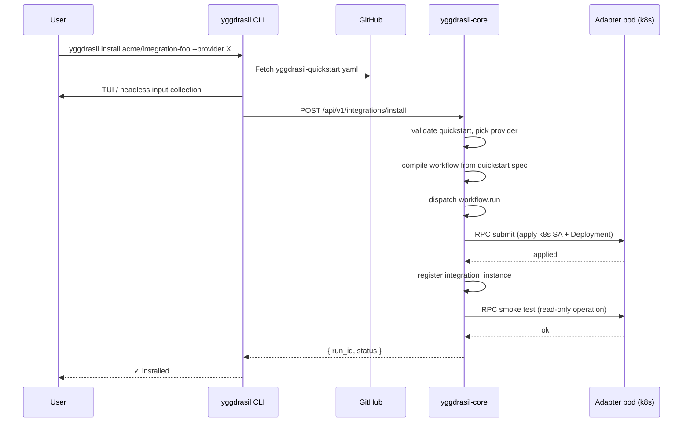

# Integrations

Integrations are how Yggdrasil reaches out to other systems. Every
external action — apply a Kubernetes object, rotate an AWS secret,
trigger a GitHub workflow — happens through an **integration adapter**:
an independent process that speaks one of the core's supported
transports (HTTP `http_json` and AMQP `rabbitmq` today; gRPC / Kafka /
NATS / any custom transport as plug-ins — see
[transports.md](./transports.md)).

This page covers the four-layer model (family → type → instance →
provider), the install and discovery flow, and the wire shape adapters
implement.

## The four-layer model



| Layer | Owns | Example |
|---|---|---|
| **Family** | The set of operations + their input/output shapes. | `schema-migrations`: `apply_migrations_spec`, `describe_applied_migrations`, `rollback_migration`. |
| **Type** | One concrete implementation of the family. | `schema-migrations-goose-postgres`: applies the family's operations using `github.com/pressly/goose`. |
| **Instance** | One deployed configuration of a type. | "schema-migrations-goose-postgres for staging cluster". |
| **Provider** | The label adopters pick when many types implement the same family. | `--provider goose-postgres` resolves to the `schema-migrations-goose-postgres` type. |

When a workflow step says:

```yaml
use:
  kind: integration
  family: schema-migrations
  operation: apply_migrations_spec
```

The engine resolves at runtime:

1. `family` → list of active types (currently
   `schema-migrations-goose-postgres`).
2. Active type → list of active instances.
3. If exactly one matches, use it. If many, fail with "ambiguous,
   pin via `provider_ref`". If none, fail with "no instance".

This is what makes integrations swappable: write workflow against the
family contract, deploy whichever provider implementation fits the
cluster.

## Install flow (`yggdrasil install`)



The quickstart manifest is what makes this one command. Each
integration repo ships a `yggdrasil-quickstart.yaml` (see
[integration-template](https://github.com/dakasa-yggdrasil/integration-template/blob/main/yggdrasil-quickstart.yaml))
that declares:

- Required adopter inputs (`instance_name`, `cluster_namespace`,
  `image`, etc.) with types, defaults, validation regex.
- The 3 install steps (apply ServiceAccount → apply Deployment →
  register instance).
- A read-only smoke operation that proves the RPC wiring works.

## Adapter wire contract

Every adapter implements three handlers minimum, addressable either as
AMQP queues (`transport: rabbitmq`) or HTTP endpoints
(`transport: http_json`):

| Capability | AMQP queue | HTTP endpoint |
|---|---|---|
| `describe` | `yggdrasil.adapter.<provider>.describe` | `POST /describe` |
| `execute` | `yggdrasil.adapter.<provider>.execute` | `POST /execute` |
| `health` | `yggdrasil.adapter.<provider>.health` | `GET /healthz` |

The request/response payloads are identical across transports — only
the addressing changes. See [transports.md](./transports.md) for the
mechanics.

### Describe response

```json
{
  "provider": "goose-postgres",
  "adapter": {
    "transport": "http_json",
    "version": "1.0.0",
    "endpoints": {
      "describe": "/describe",
      "execute":  "/execute",
      "health":   "/healthz"
    },
    "timeout_seconds": 30
  },
  "capabilities": ["describe", "execute", "health"],
  "credential_schema": { ... },
  "instance_schema":   { ... },
  "resource_types":    [ ... ],
  "action_catalog":    [ ... ]
}
```

For AMQP adapters, swap `endpoints` for `queues` with the queue names.

The core compares the live `describe` against the stored
`integration_type` manifest before every execution and fast-fails on
contract mismatch. This is how you catch "adapter v2 deployed against
contract v1" issues before they corrupt state.

### Execute request

Same JSON envelope on both transports (AMQP message body, or HTTP POST
body):

```json
{
  "operation": "apply_migrations_spec",
  "capability": "execute",
  "input": { /* operation-specific */ },
  "auth":    { /* caller credential context */ },
  "metadata": { "workflow": "...", "step_id": "..." },
  "integration": {
    "type":     { "namespace": "global", "name": "schema-migrations-goose-postgres" },
    "instance": { "namespace": "global", "name": "..." },
    "credentials": { /* resolved from secret refs */ }
  }
}
```

### Execute response

```json
{
  "operation": "apply_migrations_spec",
  "status":   "succeeded",
  "output":   { /* operation-specific */ },
  "metadata": { "applied_count": 3 }
}
```

Statuses the core knows: `succeeded`, `failed`, `partial`,
`not_ready`. Anything else gets normalized to `failed` defensively.

## Catalog convention

Integrations are grouped in the catalog by `(domain, section, entry)`:

- `domain` — what the integration is about (`rabbitmq`, `aws`,
  `kubernetes`).
- `section` — `installations` (substrate-specific install) vs
  `operations` (runtime/governance).
- `entry` — the concrete provider (`kubernetes`, `runtime`,
  `topology`).

Set as labels on `integration_type`:

```yaml
metadata:
  labels:
    yggdrasil.io/catalog-domain: rabbitmq
    yggdrasil.io/catalog-section: operations
    yggdrasil.io/catalog-entry: topology
```

The console + `GET /api/v1/integration-catalog` use these to render
the discoverable browse view.

## Operate it

**Monitor:**

- `integration.execute` timeouts + error rate, per family. The shape
  of the metric is transport-agnostic; how you scrape it varies by
  transport (AMQP queue depth vs HTTP 5xx count).
- Per-instance describe handshake state. The core stores the live
  state under `integration_instance_runtime_state`.
  Healthy / `contract_mismatch` / `unreachable` / `invalid_response`.
- Background reconciler interval (`INTEGRATION_RUNTIME_MONITOR_INTERVAL_SECONDS`,
  default 60s).

**Tune:**

- Adapter pod replicas. Parallelism scales with replica count for
  both transports (AMQP distributes via consumer-group semantics;
  HTTP distributes via LB).
- `adapter.timeout_seconds` per type. Set per the slowest realistic
  operation.

**Back up:**

Integration manifests are normal manifests. Adapter pods are
stateless — the install flow can re-create any instance from the same
quickstart.

## Pitfalls

- **Deploying adapter v2 without bumping `adapter.version`.** The
  core's describe-handshake check will pass even though the contract
  drifted. Bump `adapter.version` whenever you change a queue name,
  add/remove an operation, or change a request/response shape.
- **Putting credentials in `instance.config`.** They'll appear in
  `yggdrasil get integration_instance -o yaml`. Use `credentials_ref:
  secret://...` instead. See [secrets.md](./secrets.md).
- **Per-call instance creation.** Spinning up an instance per
  workflow run is an anti-pattern — the catalog blows up. Reuse a
  shared instance per environment, parameterize per-call payloads
  through the workflow inputs.
- **Long-running operations without timeouts.** Adapter timeout +
  transport delivery timeout multiply (AMQP message TTL for the
  `rabbitmq` transport, HTTP client timeout for `http_json`, whatever
  the plug-in declares for other transports). If your operation can
  take 5 minutes, declare `adapter.timeout_seconds: 600` on the type
  manifest **and** `timeout_seconds: 600` on the workflow step.
