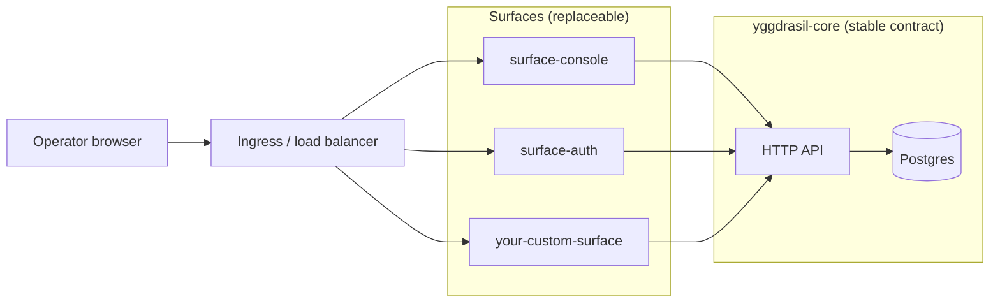

# Surfaces

Surfaces are the inbound edges of a Yggdrasil deployment — the things
humans and external systems talk to. They consume the core's HTTP
contracts and expose a UI, a domain-specific API, or an auth flow.
**They never own state.** All state stays in the core.

## What it is

```yaml
apiVersion: yggdrasil.io/v1alpha1
kind: surface
metadata:
  name: my-admin-console
  namespace: global
spec:
  category: console
  owners: [team:platform]
  integration_binding: core_only
  runtime:
    kind: http_api
    exposure: collaborator
    port: 9090
    base_path: /
    health_path: /healthz
  core_contracts: [auth, authorization, manifest, workflow]
  capabilities:
    - { name: home,    kind: ui_area, audience: collaborator, path: / }
    - { name: catalog, kind: ui_area, audience: collaborator, path: /catalog }
```

Registering a surface manifest tells the core "this edge exists, it
talks to me, here's what it claims to do". The core uses this for
discovery (`/api/v1/surfaces`), auth flows that span surfaces, and
audit context.

## Why surfaces are decoupled

Other platforms tend to bake the UI into the core binary. Yggdrasil
does the opposite — the console is a separate process, a separate
repo, registered as a manifest. Three reasons:

1. **You can replace it.** If your team prefers a different look, a
   different framework, a different audience focus, fork
   `surface-console` or build from `surface-template`.
2. **You can compose it.** Add a domain-specific BFF (billing console,
   incident response console, customer-support read-only console)
   without touching the core.
3. **The contract stays public.** A surface only consumes the same
   `/api/v1/...` endpoints the CLI consumes. The contract you use is
   the contract anyone uses.

## First-party surfaces

Two ship today:

| Surface | Purpose |
|---|---|
| [surface-console](https://github.com/dakasa-yggdrasil/surface-console) | Browser admin console — manifest catalog, workflows, runs, integrations. |
| [surface-auth](https://github.com/dakasa-yggdrasil/surface-auth) | Browser auth edge — login form, OAuth/OIDC redirect, session cookie. |

Both are reference implementations. Replace either with your own.

## Build your own

```sh
yggdrasil new surface my-thing --owner my-org
```

Scaffolds from
[surface-template](https://github.com/dakasa-yggdrasil/surface-template).
Compilable on the spot. See [extending.md](../extending.md) for the
full walkthrough.

## Architecture pattern



Surfaces share **session cookies** when configured under the same
domain (`AUTH_SESSION_COOKIE_DOMAIN`). One login → every registered
surface knows you.

## Registering a surface

Apply the manifest:

```sh
yggdrasil apply -f my-surface.yaml
```

Or, in a yggdrasil monorepo workspace:

```sh
yggdrasil surfaces install my-thing
yggdrasil surfaces activate my-thing
```

Activation is what tells the local compose stack to start that
surface alongside the core.

## Operate it

**Monitor:**

- Surface `/healthz` from the same probe stack you use for the core.
- Per-surface request rate, latency, error rate. Surfaces are stateless,
  so SRE concerns are pure HTTP serving.
- Session cookie refresh + revocation rate when surfaces share a
  cookie domain.

**Tune:**

- Surface replicas independently from the core. A spike in console
  users doesn't affect adapter dispatch capacity.
- HTTP timeouts per surface. The console can wait; an automation BFF
  cannot.

**Back up:**

Nothing to back up surface-side — they're stateless.

## Pitfalls

- **Putting state in a surface.** The temptation is real (a "draft
  manifests" UI flow that stores partials in the surface). Resist —
  surfaces should be replaceable. State that needs to survive
  surface restart belongs in the core (a `draft_manifest` kind, for
  example) or in the user's browser.
- **Skipping the manifest.** A surface that talks to the core without
  registering itself is invisible to audit, doesn't appear in
  discovery, and can't share session cookies cleanly. Always register.
- **Re-implementing core endpoints.** A surface that proxies
  `/api/v1/manifests` adds complexity for no benefit. Surfaces should
  only add UX, not duplicate the API.
- **Owners drift.** The `owners` field is a stable metadata pointer;
  keep it accurate. Audit sweeps look at this when something's
  broken at 3 AM.
