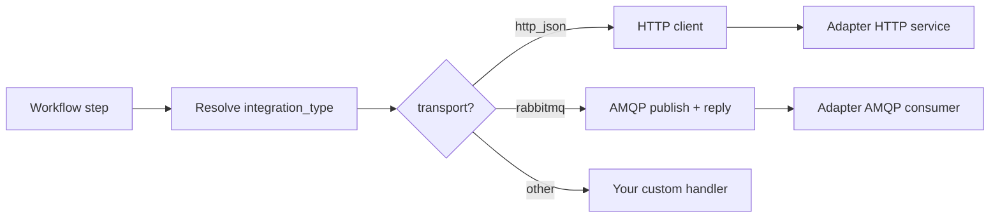

# Transports

Yggdrasil doesn't tie you to a specific message broker or RPC style.
Integrations declare their transport in the `integration_type`
manifest, and the core routes accordingly. Today two transports are
implemented; adding more is a small, local change.

## What transport means here

A **transport** is how the core talks to an integration adapter. It is
*not* how adopters talk to the core — the core's public surface for
humans and the CLI is HTTP REST. Transport is only the wire between
the engine and the pluggable adapters it dispatches to.

## Transports shipped today

| Transport | When to use | Ops cost |
|---|---|---|
| `http_json` | Adapters exposed as HTTP services (Kubernetes Services, cloud Functions, sidecars). Easiest starting point. No broker needed. | Stateless HTTP. Standard LBs/ingress apply. |
| `rabbitmq` | AMQP-based request/response. Better for many-replica adapter fleets where you want the broker to distribute work. | Requires RabbitMQ (or any AMQP 0-9-1 broker). |

Both are production-grade. Pick per deployment — one integration can
be `rabbitmq`, another `http_json`, in the same core.

## Declared per integration_type

```yaml
apiVersion: yggdrasil.io/v1alpha1
kind: integration_type
metadata: { name: my-service, namespace: global }
spec:
  provider: my-service
  adapter:
    # Pick one.
    transport: http_json
    version: "1.0.0"
    # http_json uses endpoints:
    endpoints:
      describe: /describe
      execute:  /execute
      health:   /healthz
    timeout_seconds: 30
    # rabbitmq uses queues:
    # queues:
    #   describe: yggdrasil.adapter.my-service.describe
    #   execute:  yggdrasil.adapter.my-service.execute
    #   health:   yggdrasil.adapter.my-service.health
  capabilities: [describe, execute, health]
```

The core normalizes `spec.adapter.transport`, validates that the
corresponding address block (`endpoints` OR `queues`) is populated,
and routes each call accordingly.

## How the core routes



The switch lives in a single place in the source —
`controllers/message/integration_describe.go`. Adding a new
transport (gRPC, Kafka, NATS, SQS, Pub/Sub) is three things:

1. Add the case to the switch that picks the connectivity check.
2. Add the dispatch helper (publish request, await reply, or
   equivalent in the new protocol).
3. Document the new `spec.adapter.<kind>` address block.

Concretely, if someone wants gRPC: add
`case "grpc": return checkGRPCTransportConnectivity(...)`, add
`spec.adapter.grpc_service: ...` to the model, implement the gRPC
stub for dispatch. That's it. No core rewrite.

## Does the deployment need RabbitMQ?

**Only if any integration uses `transport: rabbitmq`.** The core's
RabbitMQ addon is gated on the `BROKER_URL` env var; when unset the
addon logs `rabbitmq addon skipped because BROKER_URL is not set`
and the core boots without any AMQP connection at all.

So:

- **Pure HTTP deployment** — no broker. Your adapters are HTTP
  services behind the same ingress/LB as the core.
- **Pure AMQP deployment** — RabbitMQ alongside Postgres. `yggdrasil
  init` ships this by default because one-command-bootstrap.
- **Mixed deployment** — some adapters HTTP, some AMQP. Both work
  side-by-side; `integration_type.spec.adapter.transport` is what
  decides for each.

The `yggdrasil init` compose file declares a RabbitMQ service under a
`amqp` compose profile — **off by default**. Enable it only if you
use AMQP-transport integrations:

```sh
docker compose --profile amqp up -d
```

You can also:

- Turn the broker off in the Helm values (`rabbitmq.enabled: false`,
  which is the default) if you don't use AMQP-transport integrations.
- Register any other `rpc.Transport` backend (gRPC, Kafka, NATS, …)
  and use it exclusively — yggdrasil-core itself has zero hard
  dependency on any specific transport beyond the always-on HTTP API.

## Choosing a transport for a new integration

A rough guide for the adapter author:

| Situation | Recommended |
|---|---|
| Adapter is a long-lived pod in Kubernetes | Either. `rabbitmq` scales better with many replicas; `http_json` is simpler. |
| Adapter is a cloud Function / serverless | `http_json` (no broker client in a short-lived runtime). |
| Adapter needs backpressure / throttling via queue depth | `rabbitmq`. |
| Adapter is a sidecar to another service | `http_json` over loopback. |
| You don't want to run any broker at all | `http_json`. |
| You want parallel work distribution across N replicas | `rabbitmq`. |

## Custom transport contract

When you add a new transport (in your fork or as an upstream PR), the
contract you implement is:

```go
type TransportHandler interface {
    // CheckConnectivity is called by the background health reconciler
    // and before every execute dispatch.
    CheckConnectivity(ctx, instanceSpec, typeSpec) (status string, meta map[string]any, err error)

    // ExecuteIntegration dispatches a single execute operation and
    // awaits the adapter's reply. The envelope (instance + type
    // context, input, auth, metadata) is passed through unchanged;
    // only the wire protocol is transport-specific.
    ExecuteIntegration(ctx, req) (resp, err)

    // Describe verifies the adapter's live contract matches the
    // stored integration_type.
    Describe(ctx, instanceSpec, typeSpec) (describe_response, err)
}
```

The existing `rabbitmq` and `http_json` handlers are the reference
implementations — each is ~200 lines of Go. A gRPC handler would be
similar; a Kafka one would need consumer-group mechanics for the
reply but still fits the same shape.

## Out-of-process transport plugins (experimental)

In addition to the compiled-in transports, the core can load transport
backends as out-of-process plugins using
[hashicorp/go-plugin](https://github.com/hashicorp/go-plugin). This is
the path for transports the core doesn't want to vendor — proprietary
brokers, experimental backends, custom wire formats.

Plugin layout: any executable file named `yggdrasil-transport-<name>`
inside the directory pointed to by `YGGDRASIL_TRANSPORT_PLUGIN_DIR` is
discovered. The core spawns the subprocess on demand, handshakes with
`hashicorp/go-plugin` (magic cookie + protocol version), and exposes
the plugin as an `rpc.Transport` to the rest of the engine.

Plugin contract (trimmed; see `internal/transportplugin/plugin.go`):

```go
type Transport interface {
    Name() (string, error)
    Dispatch(req DispatchRequest) (DispatchReply, error)
    Close() error
}
```

A minimal plugin is three screens of Go. Full worked example lives at
`cmd/transport-echo/`:

```go
package main

import (
    "github.com/hashicorp/go-plugin"
    "github.com/dakasa-yggdrasil/yggdrasil-core/internal/transportplugin"
)

type echoTransport struct{}

func (echoTransport) Name() (string, error) { return "echo", nil }
func (echoTransport) Dispatch(req transportplugin.DispatchRequest) (transportplugin.DispatchReply, error) {
    return transportplugin.DispatchReply{Body: req.Body, ContentType: req.ContentType}, nil
}
func (echoTransport) Close() error { return nil }

func main() {
    plugin.Serve(&plugin.ServeConfig{
        HandshakeConfig: transportplugin.Handshake,
        Plugins:         transportplugin.PluginMap(echoTransport{}),
    })
}
```

Build + install:

```sh
go build -o /var/lib/yggdrasil/plugins/yggdrasil-transport-echo ./cmd/transport-echo
YGGDRASIL_TRANSPORT_PLUGIN_DIR=/var/lib/yggdrasil/plugins ./yggdrasil-core
```

**Status**: the plugin infrastructure is wired and tested
end-to-end (`internal/transportplugin`), but the workflow dispatcher
still routes through the compiled-in `rabbitmq` / `http_json`
handlers. Hooking the dispatcher into the plugin loader is the next
phase — until then, plugins are addressable but not dispatchable from
`integration_type.spec.adapter.transport`.

## Why not one transport to rule them all?

We considered settling on a single transport for simplicity. Three
reasons we kept it pluggable:

- **Organizations have existing brokers.** Telling a team
  "Yggdrasil requires RabbitMQ" when they already run Kafka is a
  non-starter.
- **Serverless adapters** can't sit on long-lived AMQP connections.
  HTTP is their native shape.
- **Future-proofing.** A year from now, HTTP/2 streaming, gRPC,
  WebSockets, or a new broker will be the right default for some
  workload. The pluggability is what lets Yggdrasil absorb that
  without a protocol rewrite.

## Operational implications

- **Health.** Each transport has its own `describe` and connectivity
  check. The result lands in `integration_instance_runtime_state`
  the same way regardless — your dashboards don't care.
- **Scaling.** AMQP scales by adding adapter replicas (queue consumers);
  HTTP scales by adding adapter replicas behind an LB. See
  [operations/scaling.md](../operations/scaling.md#adapter-pods).
- **Failure modes.** AMQP failure looks like "no reply from queue";
  HTTP failure looks like "502 from adapter service". Both surface
  as workflow step errors with actionable metadata.
- **Backups.** Transport carries no durable state. RabbitMQ queues
  are re-declared on connect; HTTP is stateless. Backup concerns
  are 100% on Postgres — see
  [operations/backup-restore.md](../operations/backup-restore.md).

## Pitfalls

- **Forgetting to set `BROKER_URL`.** If any integration uses
  `rabbitmq` transport and the broker env isn't set, calls to that
  integration fail at dispatch with a clear "transport not
  initialized" error. Fix: set `BROKER_URL` or switch the
  integration to `http_json`.
- **Mixing queues and endpoints on the same type.** The validator
  requires exactly one address block populated. Don't fill both
  hoping for fallback — it's not a thing.
- **Transport drift at runtime.** If you change
  `spec.adapter.transport` on a running integration, the background
  health reconciler will switch its probe on the next tick
  (≤ 60s). Live workflow runs in flight may still use the previous
  transport for their current step. Plan changes at low traffic.
