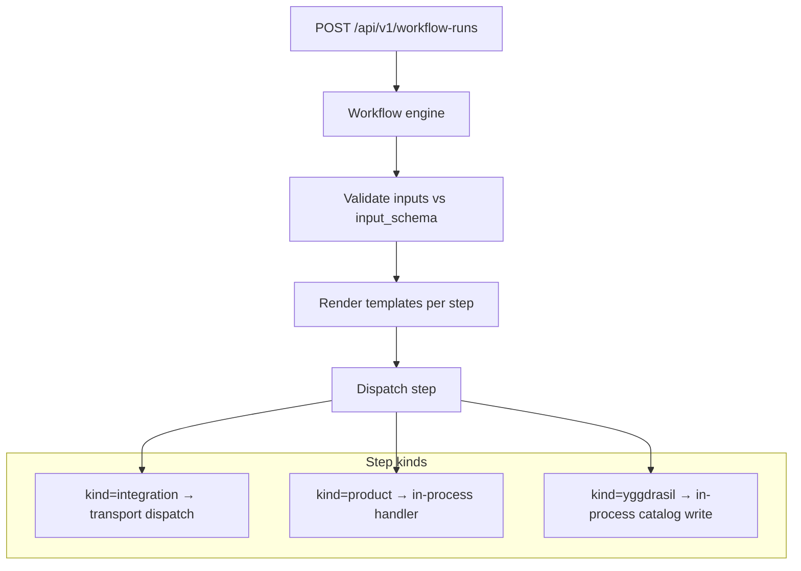

# Workflows

A workflow is a manifest that describes a DAG of steps to run.
Workflows are first-class citizens of the catalog — versioned,
auditable, RBAC-able, and dispatchable through any registered
`rpc.Transport` (the core ships HTTP and AMQP backends; gRPC / Kafka /
NATS / anything else plugs in the same way — see
[transports.md](./transports.md)).

## What it is

```yaml
apiVersion: yggdrasil.io/v1alpha1
kind: workflow
metadata:
  name: deploy-service
  namespace: global
spec:
  trigger:
    mode: manual                  # manual | event | schedule

  input_schema:
    additionalProperties: false  # reject undeclared top-level inputs
    required: [service, env]
    properties:
      service:
        type: string
        minLength: 1
        maxLength: 63
        pattern: '^[a-z0-9]([-a-z0-9]*[a-z0-9])?$'
      env:     { type: string }
      ref:     { type: string }

  defaults:
    ref: main

  steps:
    - id: dispatch-ci
      use:
        kind: integration
        family: github
        operation: dispatch_workflow
      with:
        repository: "my-org/{{ inputs.service }}"
        workflow: deploy.yml
        ref: "{{ inputs.ref }}"
        inputs: { environment: "{{ inputs.env }}" }
      retry:
        max_attempts: 1
      timeout_seconds: 1800

    - id: notify
      depends_on: [dispatch-ci]
      use:
        kind: integration
        family: slack
        operation: post_message
      with:
        channel: "#deploys"
        text: "Deployed {{ inputs.service }} to {{ inputs.env }}"
```

## How it works



The engine builds an execution order from `depends_on` (topological
sort, fail-fast on cycle), then walks the order. Each step:

1. **Renders templates** in `with` against `inputs`, `metadata`,
   `auth`, and previous step results.
2. **Evaluates `condition`** if present (skip the step on false; fail
   the step on bad template).
3. **Dispatches** based on `use.kind`:
   - `integration` → resolve family/instance, dispatch through the
     integration's transport (HTTP / AMQP / any registered
     `rpc.Transport`), await reply.
   - `product` → run an in-process product handler (apply, observe,
     uninstall).
   - `yggdrasil` → write a manifest into the catalog
     (used for one-shot `register-instance` style steps).
4. **Retries** per `retry.max_attempts` with optional
   `retry.backoff_seconds`.
5. **Records** the result (status, attempts, error, metadata,
   started_at, finished_at).

A failed step aborts the run immediately. A `skipped` step (false
condition) does not — downstream steps continue.

For asynchronous runs, the same manifest and input validation happens before
the pending `workflow_runs` row is created. Schemas remain open by default;
set `input_schema.additionalProperties: false` when every accepted top-level
input is declared in `properties`. String properties enforce `minLength`,
`maxLength`, and `pattern` against the effective inputs after defaults are
merged and before persistence or dispatch. `maxLength` counts Unicode code
points. Patterns use Go's RE2-compatible regular expressions and follow JSON
Schema search semantics, so anchor them with `^` and `$` when the whole value
must match. Invalid patterns and contradictory length bounds make the workflow
manifest invalid.

## Step kinds

### `kind: integration`

The most common. Resolves the integration_instance from
`use.instance_ref` OR `use.family + use.operation` (with optional
`provider_ref` to disambiguate when multiple providers implement the
same family). Dispatches via the integration's transport (`rpc.Transport`
— HTTP, AMQP, or any registered plug-in), returns the adapter's
response as the step metadata.

### `kind: product`

Runs an in-process product lifecycle operation. Operations:
`installation.apply`, `installation.observe`,
`installation.uninstall`. Used by the platform-delivery side of the
catalog — see [products.md](./products.md).

### `kind: yggdrasil`

Writes a manifest against the core's own catalog. The single
operation today is `apply_manifest` — the step's `with.manifest`
field is the manifest document. This is what
`integration_quickstart` install flows use to register the freshly
installed instance:

```yaml
- id: register-instance
  use: { kind: yggdrasil, operation: apply_manifest }
  with:
    manifest:
      apiVersion: yggdrasil.io/v1alpha1
      kind: integration_instance
      metadata: { name: "{{ inputs.instance_name }}", namespace: global }
      spec: { type_ref: { ... } }
```

Loopback into the same core, in the same DB transaction the run
runs in.

## Template rendering

Inputs to template rendering:

- `inputs.<key>` — runtime input from the dispatch.
- `defaults.<key>` — workflow-level defaults merged with inputs.
- `metadata.<key>` — dispatch metadata (caller, source, request id).
- `auth.token` — caller token (when present).
- `workflow.name`, `workflow.namespace`, `workflow.version`.
- `steps.<step-id>.metadata.<key>` — output of a previous step.
- `steps.<step-id>.error`, `.status`, `.attempts`.

Syntax: `{{ <path> }}`. The renderer is recursive — strings, maps,
slices are all walked. Unresolvable templates fail the step
loud-and-explicit (no silent empty-string substitution).

### Sensitive workflow inputs

Prefer a `credentials_ref` or another secret reference over passing secret
material as a workflow input. When a workflow genuinely needs an input value
only during its current execution, classify its property with `secret: true`
or `sensitive: true`:

```yaml
input_schema:
  additionalProperties: false
  required: [bootstrap_token]
  properties:
    bootstrap_token: { type: string, secret: true }
```

The in-memory execution copy retains the original value so
`{{ inputs.bootstrap_token }}` still renders. Asynchronous
`workflow_runs.inputs` stores `[REDACTED]` instead. Durable history is not a
secret recovery or replay mechanism. The current engine never rebuilds a run
from that column: a process restart leaves the in-memory value unavailable and
the stale-run cleaner eventually cancels the orphaned run. Retries must provide
the sensitive value again. Any future durable-resume implementation must reject
the marker and require a new value or a resolvable secret reference.

The classification applies to `inputs`, not arbitrary request `metadata` or an
event payload that was already durably recorded at its source. Do not duplicate
secret material into those fields. An adapter that returns a secret must also
declare its `sensitive_output_paths`; input classification cannot infer or
sanitize an unmarked adapter response.

### Sensitive integration outputs

An integration that returns a provider-generated secret exactly once marks
its paths relative to `metadata.output`:

```json
{
  "output": {
    "resource_id": "webhook-123",
    "secret_shared_key": "one-time-value"
  },
  "metadata": {
    "sensitive_output_paths": ["secret_shared_key"]
  }
}
```

The engine never puts the original value in the general workflow execution
context. It creates a private one-step lease only when the actual topological
next step has this exact shape:

```yaml
- id: persist-webhook-secret
  depends_on: [provision-webhook]
  use:
    kind: integration
    family: secrets-management
    operation: ensure_secret
  with:
    secret:
      secret_id: stripe/webhook
      generation:
        strategy: manual
        manual:
          value: "{{ steps.provision-webhook.metadata.output.secret_shared_key }}"
```

V1 permits one top-level string path and one consumer. Producer and sink must be
adjacent, the sink must depend on exactly the producer, neither step may use
`condition` or `for_each`, and the sink's resolved integration type must declare
the `secrets-management` family and implement `ensure_secret`. The template must
be the complete value of
`secret.generation.manual.value`; concatenation, nesting, aliases, and a second
consumer prevent the Core handshake from being issued. A producer must use one
attempt; v1 does not retry provider creation after an ambiguous response. The
idempotent secret sink may retry. Producer operation and capability must agree;
sink operation and capability must both normalize to `ensure_secret`.
`secret.secret_id` must render to a concrete non-empty string and
`secret.generation.strategy` must be the literal `manual`.

For an eligible pair, the Core injects `supports_sensitive_output_paths` and a
derived `sensitive_output_sink` block into producer request metadata. It injects
`sensitive_input_lease` into the sink request. These three top-level metadata
keys are reserved: public or direct integration execute requests containing any
of them fail before adapter dispatch.

Only an authorized workflow producer call may return a response that declares
`sensitive_output_paths`. A public/direct or unrelated internal execute call
that receives such a response fails generically and returns no adapter output.

The producer response path list must exactly equal the Core-authorized path.
Missing, empty, malformed, duplicate, extra, non-string, or unresolvable paths
fail with `sensitive_output_contract_violation`, discard the adapter metadata,
and redact the complete output. Returning the authorized source field without a
declaration also fails closed; a source-free ordinary/no-op response creates no
lease. A valid producer result is copied and redacted before it enters
`WorkflowExecutionContext.Steps`, the synchronous response, or asynchronous
`workflow_runs.result`.

Only the designated sink input renderer receives the leased value. Integration
selection, conditions, fan-out, and every later step see the redacted context.
Sink retries reuse that one rendered input. The resolved sink instance/type ID
and version must still match the preauthorized sink. HTTP error bodies and AMQP
adapter messages are removed from eligible producer and leased-sink errors, and
the adapter's sink response is discarded. Only explicit `created`, `updated`,
or `unchanged` evidence for the requested operation/capability produces the
fixed, value-free receipt. The lease is cleared after sink success, failure,
cancellation, or panic propagation.

`workflow.run.completed` is derived from the public response and currently
contains no step output. Never place a generated secret in workflow inputs,
dispatch metadata, errors, logs, resources, adoption responses, or mutation
events. This contract limits application reachability and serialization; it
does not claim physical zeroization of immutable Go strings.

## Machine dispatch boundary

Non-human callers use a raw bearer kept in their own secret store. The core
configuration stores only its SHA-256 digest in
`YGGDRASIL_WORKFLOW_MACHINE_PRINCIPALS_JSON`, together with lifecycle and
rotation metadata and a non-empty list of exact workflow `{namespace,name}`
pairs. Wildcards are rejected. The server resolves the selected manifest and
enforces that allowlist on every dispatch. A workflow without
`spec.authorization` is denied to machine callers; its declared RBAC and
optional policy are evaluated afterward as an additional mandatory gate.
Machine callers must select by namespace/name and resolve only the current
active workflow. The API rejects `manifest_id` and explicit `version` selectors
for these callers so an allowed logical name cannot be redirected to an older
or inactive contract.

Do not send a `principal_id` or creator identity in request metadata. Hashed
machine dispatch is always asynchronous, even if the request supplies
`?async=false` or a `sync` header. The server overwrites the reserved
`yggdrasil.io/creator_machine_principal_id` field with the authenticated
principal. Poll the returned id with the same bearer: machine callers receive
only their own runs, while both foreign and absent ids return 404. A stable
`metadata.idempotency_key` is scoped by the server to the authenticated
principal before persistence, so another principal cannot receive the run id
through a retry. The original key remains available only to the live execution
copy.

Workflow credentials are valid only for the canonical dispatch and poll
routes. They cannot publish events or access manifests, deploy, secrets,
`/console`, generic `/ops`, tenant, or auth-admin APIs. See
[ADR-0017](../adr/0017-scope-machine-principals-by-route-workflow-and-run-ownership.md).

## Wire shape

### POST /api/v1/workflow-runs

```json
{
  "workflow": { "namespace": "global", "name": "deploy-service" },
  "inputs": { "service": "billing", "env": "prod" },
  "auth":   { "token": "..." },
  "metadata": {
    "source": "github-action",
    "request_id": "...",
    "idempotency_key": "deploy-service:commit-sha"
  }
}
```

Send the machine bearer through `X-Yggdrasil-Workflow-Token` or
`Authorization: Bearer ...`. Machine dispatch is durably asynchronous without
requiring `?async=true`; a sync opt-out is ignored. The first request returns
`202` with `run_id` and `deduped:false`; an idempotent retry returns `200` with
the same owned `run_id` and `deduped:true`.

Response (synchronous mode, human or time-bounded migration callers only):

```json
{
  "workflow":   { "namespace": "global", "name": "deploy-service", "version": 7 },
  "status":     "succeeded",
  "started_at": "...",
  "finished_at": "...",
  "steps": [
    { "id": "dispatch-ci", "status": "succeeded", "attempts": 1,
      "metadata": { "ci_run_url": "https://github.com/..." } },
    { "id": "notify", "status": "succeeded", ... }
  ]
}
```

The same dispatch is available asynchronously over any additional
`rpc.Transport` registered in the deployment (the AMQP backend, for
example, exposes `workflow.dispatch` as a queue). `workflow.run` is
the in-band synchronous form over HTTP.

## Operate it

**Monitor:**

- `workflow.run.succeeded` / `.failed` event rates per workflow.
- p95 + p99 step duration. The engine emits per-step `started_at` /
  `finished_at` so this is free to derive.
- Adapter timeouts — these surface as `step.error == "timeout"`. A
  spike points at a sick adapter, not a workflow author bug.

**Tune:**

- `defaultWorkflowStepTimeout` (currently 20s) — the integration
  dispatch timeout when the step's own `timeout_seconds` is unset.
- `retry.max_attempts` per-step. Default 1 (no retry).

**Back up:**

Workflow definitions are normal manifests, in the standard backup.
Workflow runs are stored in `workflow_run` + `workflow_run_step` and
also captured in events — back up Postgres and you have everything.

## Pitfalls

- **Long-running steps.** The default 20s step timeout is fine for
  most adapter calls but kills any step that waits for something.
  Set `timeout_seconds: 1800` (or longer) on CI dispatches and human
  approvals — see [ecosystem/ci-cd.md](../ecosystem/ci-cd.md).
- **Retry loops on dispatch.** A retried CI/Argo dispatch creates
  duplicate runs. Always set `retry.max_attempts: 1` on dispatching
  steps and rely on the downstream system's own retry semantics.
- **Templates that fail silently.** Yggdrasil treats unresolvable
  templates as a step failure — this is intentional. If you want a
  template that gracefully omits, use a `condition` to gate the step
  instead of an empty-string fallback.
- **Cycles via `depends_on`.** Detected at validation time and
  rejected with a clear error. The cycle path is named in the error.
- **Step `id` reuse.** Step ids must be unique within a workflow. If
  you're appending a "retry" step that does the same thing, give it a
  distinct id (`deploy`, `deploy-retry`).
