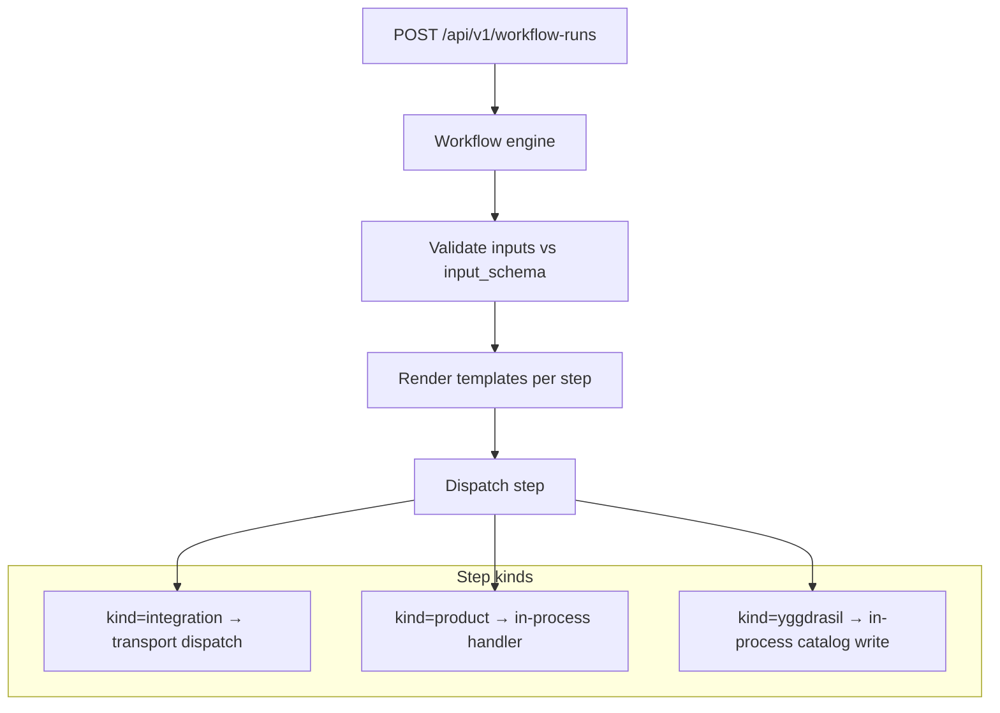

# Workflows

A workflow is a manifest that describes a DAG of steps to run.
Workflows are first-class citizens of the catalog — versioned,
auditable, RBAC-able, and dispatchable through any registered
`rpc.Transport` (the core ships HTTP and AMQP backends; gRPC / Kafka /
NATS / anything else plugs in the same way — see
[transports.md](./transports.md)).

## What it is

```yaml
apiVersion: yggdrasil.io/v1alpha1
kind: workflow
metadata:
  name: deploy-service
  namespace: global
spec:
  trigger:
    mode: manual                  # manual | event | schedule

  input_schema:
    required: [service, env]
    properties:
      service: { type: string }
      env:     { type: string }
      ref:     { type: string }

  defaults:
    ref: main

  steps:
    - id: dispatch-ci
      use:
        kind: integration
        family: github
        operation: dispatch_workflow
      with:
        repository: "my-org/{{ inputs.service }}"
        workflow: deploy.yml
        ref: "{{ inputs.ref }}"
        inputs: { environment: "{{ inputs.env }}" }
      retry:
        max_attempts: 1
      timeout_seconds: 1800

    - id: notify
      depends_on: [dispatch-ci]
      use:
        kind: integration
        family: slack
        operation: post_message
      with:
        channel: "#deploys"
        text: "Deployed {{ inputs.service }} to {{ inputs.env }}"
```

## How it works



The engine builds an execution order from `depends_on` (topological
sort, fail-fast on cycle), then walks the order. Each step:

1. **Renders templates** in `with` against `inputs`, `metadata`,
   `auth`, and previous step results.
2. **Evaluates `condition`** if present (skip the step on false; fail
   the step on bad template).
3. **Dispatches** based on `use.kind`:
   - `integration` → resolve family/instance, dispatch through the
     integration's transport (HTTP / AMQP / any registered
     `rpc.Transport`), await reply.
   - `product` → run an in-process product handler (apply, observe,
     uninstall).
   - `yggdrasil` → write a manifest into the catalog
     (used for one-shot `register-instance` style steps).
4. **Retries** per `retry.max_attempts` with optional
   `retry.backoff_seconds`.
5. **Records** the result (status, attempts, error, metadata,
   started_at, finished_at).

A failed step aborts the run immediately. A `skipped` step (false
condition) does not — downstream steps continue.

## Step kinds

### `kind: integration`

The most common. Resolves the integration_instance from
`use.instance_ref` OR `use.family + use.operation` (with optional
`provider_ref` to disambiguate when multiple providers implement the
same family). Dispatches via the integration's transport (`rpc.Transport`
— HTTP, AMQP, or any registered plug-in), returns the adapter's
response as the step metadata.

### `kind: product`

Runs an in-process product lifecycle operation. Operations:
`installation.apply`, `installation.observe`,
`installation.uninstall`. Used by the platform-delivery side of the
catalog — see [products.md](./products.md).

### `kind: yggdrasil`

Writes a manifest against the core's own catalog. The single
operation today is `apply_manifest` — the step's `with.manifest`
field is the manifest document. This is what
`integration_quickstart` install flows use to register the freshly
installed instance:

```yaml
- id: register-instance
  use: { kind: yggdrasil, operation: apply_manifest }
  with:
    manifest:
      apiVersion: yggdrasil.io/v1alpha1
      kind: integration_instance
      metadata: { name: "{{ inputs.instance_name }}", namespace: global }
      spec: { type_ref: { ... } }
```

Loopback into the same core, in the same DB transaction the run
runs in.

## Template rendering

Inputs to template rendering:

- `inputs.<key>` — runtime input from the dispatch.
- `defaults.<key>` — workflow-level defaults merged with inputs.
- `metadata.<key>` — dispatch metadata (caller, source, request id).
- `auth.token` — caller token (when present).
- `workflow.name`, `workflow.namespace`, `workflow.version`.
- `steps.<step-id>.metadata.<key>` — output of a previous step.
- `steps.<step-id>.error`, `.status`, `.attempts`.

Syntax: `{{ <path> }}`. The renderer is recursive — strings, maps,
slices are all walked. Unresolvable templates fail the step
loud-and-explicit (no silent empty-string substitution).

### Sensitive integration outputs

An integration that returns a provider-generated secret exactly once marks
its paths relative to `metadata.output`:

```json
{
  "output": {
    "resource_id": "webhook-123",
    "secret_shared_key": "one-time-value"
  },
  "sensitive_output_paths": ["secret_shared_key"]
}
```

The engine keeps the original value only in the current run's in-memory
execution context, so the immediately following step can persist it through a
secret-store integration. Synchronous responses and asynchronous
`workflow_runs.result` contain `[REDACTED]` at each declared path;
`workflow.run.completed` is derived from that public response and currently
contains no step output. A malformed or missing path in a declared list
redacts the entire output fail-closed. Never place the generated value in
workflow inputs, dispatch metadata, errors, logs, or mutation events.

## Wire shape

### POST /api/v1/workflow-runs

```json
{
  "workflow": { "namespace": "global", "name": "deploy-service" },
  "inputs": { "service": "billing", "env": "prod" },
  "auth":   { "token": "..." },
  "metadata": { "source": "github-action", "request_id": "..." }
}
```

Response (synchronous mode):

```json
{
  "workflow":   { "namespace": "global", "name": "deploy-service", "version": 7 },
  "status":     "succeeded",
  "started_at": "...",
  "finished_at": "...",
  "steps": [
    { "id": "dispatch-ci", "status": "succeeded", "attempts": 1,
      "metadata": { "ci_run_url": "https://github.com/..." } },
    { "id": "notify", "status": "succeeded", ... }
  ]
}
```

The same dispatch is available asynchronously over any additional
`rpc.Transport` registered in the deployment (the AMQP backend, for
example, exposes `workflow.dispatch` as a queue). `workflow.run` is
the in-band synchronous form over HTTP.

## Operate it

**Monitor:**

- `workflow.run.succeeded` / `.failed` event rates per workflow.
- p95 + p99 step duration. The engine emits per-step `started_at` /
  `finished_at` so this is free to derive.
- Adapter timeouts — these surface as `step.error == "timeout"`. A
  spike points at a sick adapter, not a workflow author bug.

**Tune:**

- `defaultWorkflowStepTimeout` (currently 20s) — the integration
  dispatch timeout when the step's own `timeout_seconds` is unset.
- `retry.max_attempts` per-step. Default 1 (no retry).

**Back up:**

Workflow definitions are normal manifests, in the standard backup.
Workflow runs are stored in `workflow_run` + `workflow_run_step` and
also captured in events — back up Postgres and you have everything.

## Pitfalls

- **Long-running steps.** The default 20s step timeout is fine for
  most adapter calls but kills any step that waits for something.
  Set `timeout_seconds: 1800` (or longer) on CI dispatches and human
  approvals — see [ecosystem/ci-cd.md](../ecosystem/ci-cd.md).
- **Retry loops on dispatch.** A retried CI/Argo dispatch creates
  duplicate runs. Always set `retry.max_attempts: 1` on dispatching
  steps and rely on the downstream system's own retry semantics.
- **Templates that fail silently.** Yggdrasil treats unresolvable
  templates as a step failure — this is intentional. If you want a
  template that gracefully omits, use a `condition` to gate the step
  instead of an empty-string fallback.
- **Cycles via `depends_on`.** Detected at validation time and
  rejected with a clear error. The cycle path is named in the error.
- **Step `id` reuse.** Step ids must be unique within a workflow. If
  you're appending a "retry" step that does the same thing, give it a
  distinct id (`deploy`, `deploy-retry`).
