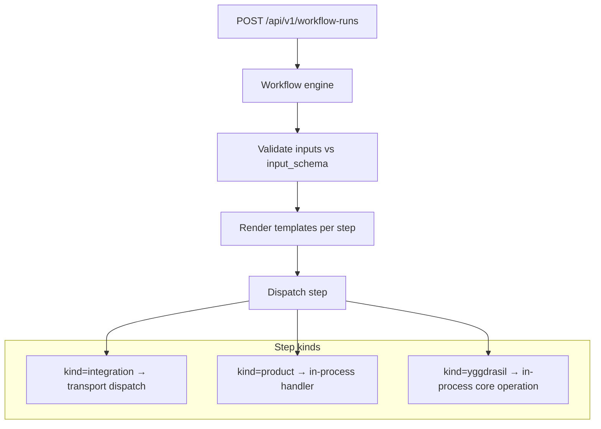

# Workflows

A workflow is a manifest that describes a DAG of steps to run.
Workflows are first-class citizens of the catalog — versioned,
auditable, RBAC-able, and dispatchable through any registered
`rpc.Transport` (the core ships HTTP and AMQP backends; gRPC / Kafka /
NATS / anything else plugs in the same way — see
[transports.md](./transports.md)).

## What it is

```yaml
apiVersion: yggdrasil.io/v1alpha1
kind: workflow
metadata:
  name: deploy-service
  namespace: global
spec:
  trigger:
    mode: manual                  # manual | event | schedule

  input_schema:
    additionalProperties: false  # reject undeclared top-level inputs
    required: [service, env]
    properties:
      service:
        type: string
        minLength: 1
        maxLength: 63
        pattern: '^[a-z0-9]([-a-z0-9]*[a-z0-9])?$'
      env:     { type: string }
      ref:     { type: string }

  defaults:
    ref: main

  steps:
    - id: dispatch-ci
      use:
        kind: integration
        family: github
        operation: dispatch_workflow
      with:
        repository: "my-org/{{ inputs.service }}"
        workflow: deploy.yml
        ref: "{{ inputs.ref }}"
        inputs: { environment: "{{ inputs.env }}" }
      retry:
        max_attempts: 1
      timeout_seconds: 1800

    - id: notify
      depends_on: [dispatch-ci]
      use:
        kind: integration
        family: slack
        operation: post_message
      with:
        channel: "#deploys"
        text: "Deployed {{ inputs.service }} to {{ inputs.env }}"
```

## How it works


```mermaid
flowchart TB
    Trigger[POST /api/v1/workflow-runs]
    Engine[Workflow engine]
    Validate[Validate inputs vs input_schema]
    Render[Render templates per step]
    Dispatch[Dispatch step]

    subgraph StepKinds["Step kinds"]
        Integration[kind=integration → transport dispatch]
        Product[kind=product → in-process handler]
        Yggdrasil[kind=yggdrasil → in-process core operation]
    end

    Trigger --> Engine
    Engine --> Validate
    Validate --> Render
    Render --> Dispatch
    Dispatch --> Integration
    Dispatch --> Product
    Dispatch --> Yggdrasil
```

Dispatch resolves only the active workflow record. An exact `manifest_id` or
`version` remains a valid pin when it identifies the currently active version,
but the same selector is refused after a newer version replaces it or the
workflow is deactivated. To roll back, re-apply the older specification so the
catalog creates a new active version; do not dispatch an inactive historical
row directly.

The engine builds an execution order from `depends_on` (topological
sort, fail-fast on cycle), then walks the order. Each step:

1. **Renders templates** in `with` against `inputs`, `metadata`,
   `auth`, and previous step results.
2. **Evaluates `condition`** if present (skip the step on false; fail
   the step on bad template).
3. **Dispatches** based on `use.kind`:
   - `integration` → resolve family/instance, dispatch through the
     integration's transport (HTTP / AMQP / any registered
     `rpc.Transport`), await reply.
   - `product` → run an in-process product handler (apply, observe,
     uninstall).
   - `yggdrasil` → run an in-process core operation, including catalog
     writes and read-only workflow assertions.
4. **Retries** per `retry.max_attempts` with optional
   `retry.backoff_seconds`.
5. **Records** the result (status, attempts, error, metadata,
   started_at, finished_at).

A failed step aborts the run immediately. A `skipped` step (false
condition) does not — downstream steps continue.

For asynchronous runs, the same manifest and input validation happens before
the pending `workflow_runs` row is created. Schemas remain open by default;
set `input_schema.additionalProperties: false` when every accepted top-level
input is declared in `properties`. String properties enforce `minLength`,
`maxLength`, and `pattern` against the effective inputs after defaults are
merged and before persistence or dispatch. `maxLength` counts Unicode code
points. Patterns use Go's RE2-compatible regular expressions and follow JSON
Schema search semantics, so anchor them with `^` and `$` when the whole value
must match. Invalid patterns and contradictory length bounds make the workflow
manifest invalid.

## Step kinds

### `kind: integration`

The most common. Resolves the integration_instance from
`use.instance_ref` OR `use.family + use.operation` (with optional
`provider_ref` to disambiguate when multiple providers implement the
same family). Dispatches via the integration's transport (`rpc.Transport`
— HTTP, AMQP, or any registered plug-in), returns the adapter's
response as the step metadata.

### `kind: product`

Runs an in-process product lifecycle operation. Operations:
`installation.apply`, `installation.observe`,
`installation.uninstall`. Used by the platform-delivery side of the
catalog — see [products.md](./products.md).

### `kind: yggdrasil`

Runs an operation inside Core without resolving an integration instance.
`apply_manifest` writes the step's `with.manifest` document to the catalog.
This is what `integration_quickstart` install flows use to register the
freshly installed instance:

```yaml
- id: register-instance
  use: { kind: yggdrasil, operation: apply_manifest }
  with:
    manifest:
      apiVersion: yggdrasil.io/v1alpha1
      kind: integration_instance
      metadata: { name: "{{ inputs.instance_name }}", namespace: global }
      spec: { type_ref: { ... } }
```

Loopback into the same core, in the same DB transaction the run uses.

`assert` is the read-only final-state guard for workflows that must fail when
observed state differs from the intended state. Its `with` object is closed:
it accepts only `equal` and `nonempty` arrays, requires at least one check,
and requires every check name to be non-empty and unique across both arrays.
`equal` uses exact Go value equality without string or numeric coercion.
`nonempty` accepts strings, arrays, slices, and maps, and fails for nil, empty,
or scalar values.

```yaml
- id: assert-final-policy
  depends_on: [observe-final-policy]
  use: { kind: yggdrasil, operation: assert }
  with:
    equal:
      - name: final_policy_spec
        actual: "{{ steps.observe-final-policy.metadata.spec }}"
        expected: "{{ steps.apply-policy.metadata.spec }}"
    nonempty:
      - name: final_policy_uid
        value: "{{ steps.observe-final-policy.metadata.uid }}"
      - name: final_policy_resource_version
        value: "{{ steps.observe-final-policy.metadata.resource_version }}"
```

Unlike `condition`, which records `skipped` when false, a failed assertion
fails the step and stops the workflow. Assertion errors identify only the
check name. Successful metadata contains only check names and counts. Rendered
`actual`, `expected`, and `value` data is never copied into errors or metadata.

## Template rendering

Inputs to template rendering:

- `inputs.<key>` — runtime input from the dispatch.
- `defaults.<key>` — workflow-level defaults merged with inputs.
- `metadata.<key>` — dispatch metadata (caller, source, request id).
- `auth.token` — caller token (when present).
- `workflow.name`, `workflow.namespace`, `workflow.version`.
- `steps.<step-id>.metadata.<key>` — output of a previous step.
- `steps.<step-id>.error`, `.status`, `.attempts`.

Syntax: `{{ <path> }}`. The renderer is recursive — strings, maps,
slices are all walked. Unresolvable templates fail the step
loud-and-explicit (no silent empty-string substitution).

### Sensitive workflow inputs

Prefer a `credentials_ref` or another secret reference over passing secret
material as a workflow input. When a workflow genuinely needs an input value
only during its current execution, classify its property with `secret: true`
or `sensitive: true`:

```yaml
input_schema:
  additionalProperties: false
  required: [bootstrap_token]
  properties:
    bootstrap_token: { type: string, secret: true }
```

The in-memory execution copy retains the original value so
`{{ inputs.bootstrap_token }}` still renders. Asynchronous
`workflow_runs.inputs` stores `[REDACTED]` instead. Durable history is not a
secret recovery or replay mechanism. The current engine never rebuilds a run
from that column: a process restart leaves the in-memory value unavailable and
the stale-run cleaner eventually cancels the orphaned run. Retries must provide
the sensitive value again. Any future durable-resume implementation must reject
the marker and require a new value or a resolvable secret reference.

The classification applies to `inputs`, not arbitrary request `metadata` or an
event payload that was already durably recorded at its source. Do not duplicate
secret material into those fields. An adapter that returns a secret must also
declare its `sensitive_output_paths`; input classification cannot infer or
sanitize an unmarked adapter response.

### Sensitive integration outputs

An integration that returns a provider-generated secret exactly once marks
its paths relative to `metadata.output`:

```json
{
  "output": {
    "resource_id": "webhook-123",
    "secret_shared_key": "one-time-value"
  },
  "metadata": {
    "sensitive_output_paths": ["secret_shared_key"]
  }
}
```

The engine never puts the original value in the general workflow execution
context. It creates a private one-step lease only when the actual topological
next step has this exact shape:

```yaml
- id: persist-webhook-secret
  depends_on: [provision-webhook]
  use:
    kind: integration
    family: secrets-management
    operation: ensure_secret
  with:
    secret:
      secret_id: stripe/webhook
      generation:
        strategy: manual
        manual:
          value: "{{ steps.provision-webhook.metadata.output.secret_shared_key }}"
```

V1 permits one top-level string path and one consumer. Producer and sink must be
adjacent, the sink must depend on exactly the producer, neither step may use
`condition` or `for_each`, and the sink's resolved integration type must declare
the `secrets-management` family and implement `ensure_secret`. The template must
be the complete value of
`secret.generation.manual.value`; concatenation, nesting, aliases, and a second
consumer prevent the Core handshake from being issued. A producer must use one
attempt; v1 does not retry provider creation after an ambiguous response. The
idempotent secret sink may retry. Producer operation and capability must agree;
sink operation and capability must both normalize to `ensure_secret`.
`secret.secret_id` must render to a concrete non-empty string and
`secret.generation.strategy` must be the literal `manual`.

For an eligible pair, the Core injects `supports_sensitive_output_paths` and a
derived `sensitive_output_sink` block into producer request metadata. It injects
`sensitive_input_lease` into the sink request. These three top-level metadata
keys are reserved: public or direct integration execute requests containing any
of them fail before adapter dispatch.

Only an authorized workflow producer call may return a response that declares
`sensitive_output_paths`. A public/direct or unrelated internal execute call
that receives such a response fails generically and returns no adapter output.

The producer response path list must exactly equal the Core-authorized path.
Missing, empty, malformed, duplicate, extra, non-string, or unresolvable paths
fail with `sensitive_output_contract_violation`, discard the adapter metadata,
and redact the complete output. Returning the authorized source field without a
declaration also fails closed; a source-free ordinary/no-op response creates no
lease. A valid producer result is copied and redacted before it enters
`WorkflowExecutionContext.Steps`, the synchronous response, or asynchronous
`workflow_runs.result`.

Only the designated sink input renderer receives the leased value. Integration
selection, conditions, fan-out, and every later step see the redacted context.
Sink retries reuse that one rendered input. The resolved sink instance/type ID
and version must still match the preauthorized sink. HTTP error bodies and AMQP
adapter messages are removed from eligible producer and leased-sink errors, and
the adapter's sink response is discarded. Only explicit `created`, `updated`,
or `unchanged` evidence for the requested operation/capability produces the
fixed, value-free receipt. The lease is cleared after sink success, failure,
cancellation, or panic propagation.

`workflow.run.completed` is derived from the public response and currently
contains no step output. Never place a generated secret in workflow inputs,
dispatch metadata, errors, logs, resources, adoption responses, or mutation
events. This contract limits application reachability and serialization; it
does not claim physical zeroization of immutable Go strings.

## Machine dispatch boundary

Non-human callers use a raw bearer kept in their own secret store. The core
configuration stores only its SHA-256 digest in
`YGGDRASIL_WORKFLOW_MACHINE_PRINCIPALS_JSON`, together with lifecycle and
rotation metadata and a non-empty list of exact workflow `{namespace,name}`
pairs. Wildcards are rejected. The server resolves the selected manifest and
enforces that allowlist on every dispatch. A workflow without
`spec.authorization` is denied to machine callers; its declared RBAC and
optional policy are evaluated afterward as an additional mandatory gate.
Machine callers must select by namespace/name and resolve only the current
active workflow. The API rejects `manifest_id` and explicit `version` selectors
for these callers so an allowed logical name cannot be redirected to an older
or inactive contract.

Do not send a `principal_id` or creator identity in request metadata. Hashed
machine dispatch is always asynchronous, even if the request supplies
`?async=false` or a `sync` header. The server overwrites the reserved
`yggdrasil.io/creator_machine_principal_id` field with the authenticated
principal. Poll the returned id with the same bearer: machine callers receive
only their own runs, while both foreign and absent ids return 404. A stable
`metadata.idempotency_key` is scoped by the server to the authenticated
principal before persistence, so another principal cannot receive the run id
through a retry. The original key remains available only to the live execution
copy.

Core reads the principals inventory and the legacy bridge settings once at
start (ADR-0022), so a rotation takes effect at the next restart. A malformed
inventory, a variable that is set but blank, or a digest another credential
scope also holds refuses the whole workflow surface: every machine dispatch
and poll answers 401 and the refusal is logged at start, next to an info
summary (`workflow run credential surface loaded`) that names the principals
and the bridge state without any digest. Unset the variable to mean "no
principals". Calling the workflow-run routes with no credential at all works
only on a Core with nothing configured and `YGGDRASIL_ENV` set to `dev`,
`development`, `local` or `test`.

The time-bounded `YGGDRASIL_WORKFLOW_RUN_TOKEN` bridge keeps working until it
is retired, but every request it authenticates is logged
(`legacy workflow-run bridge accepted`), counted in
`yggdrasil_workflow_run_legacy_bridge_requests_total{route}`, and audited as a
`workflow_run.legacy_bridge` row; an asynchronous run it dispatched carries
`yggdrasil.io/creator_legacy_workflow_bridge=true` in its metadata. Those
records identify the callers that still need to move to a principal.

Workflow credentials are valid only for the canonical dispatch and poll
routes. They cannot publish events or access manifests, deploy, secrets,
`/console`, generic `/ops`, tenant, or auth-admin APIs. See
[ADR-0017](../adr/0017-scope-machine-principals-by-route-workflow-and-run-ownership.md).

### Channels without a Core actor

The AMQP `yggdrasil-core.workflow.run` queue and GitHub push dispatch through a
`repository_binding` do not carry an authenticated Core actor that can satisfy
workflow RBAC or policy. They reject every workflow that declares
`spec.authorization`. The AMQP reply uses
`workflow_authenticated_actor_required`; repository-binding dispatch refuses
before inserting a `workflow_runs` row.

The guard and executor use the same resolved manifest and parsed spec. Core
does not check one active version and then resolve the logical workflow name a
second time for execution. Workflows without `spec.authorization` retain their
existing behavior on both channels. To protect such a workflow, move its caller
to authenticated `POST /api/v1/workflow-runs` dispatch before adding the
authorization block. See
[ADR-0027](../adr/0027-require-authenticated-actor-channels-for-authorized-workflows.md).

## Emergency dispatch lock

`YGGDRASIL_WORKFLOW_DISPATCH_LOCK_JSON` can temporarily reduce authenticated
and trusted in-process workflow dispatch sources to an exact namespace and name
allowlist. GitHub push dispatch through `repository_binding` manifests is
disabled completely during the same window:

```json
{
  "mode": "enforce",
  "allowed_workflows": [
    {"namespace": "dakasa", "name": "bump-integration-aws-sha-d1d632c"},
    {"namespace": "dakasa", "name": "unlock-yggdrasil-workflow-dispatch-production"}
  ]
}
```

The variable is strict. A blank value, malformed or trailing JSON, an unknown
field or mode, a wildcard, a duplicate, surrounding whitespace, or an empty
enforce list is invalid. Invalid configured JSON denies dispatch and fails boot
validation in every environment. Unset and
`{"mode":"off","allowed_workflows":[]}` preserve normal dispatch.

Core resolves the active workflow first and checks that resolved namespace and
name before input validation, durable run insertion, and execution. The exact
workflow check applies to human and machine HTTP dispatch, the scheduler, event
triggers, Heimdall inbox, and any queued run that reaches the handler directly.

GitHub push dispatch has a stricter rule. While enforcement is active, Core
returns `503 workflow.dispatch_locked` before parsing the push payload or
querying a repository binding, even when the bound workflow is allowlisted. The
asynchronous wrapper checks again before calling the executor that can insert a
durable run. Invalid configured lock JSON fails the same way. Unset and explicit
off modes preserve normal webhook routing.

The lock does not replace caller authorization or workflow policy. For a
dispatch source that authenticates a caller, an allowlisted workflow still
needs every credential, RBAC, policy, condition, and input check that source
normally requires. Scheduler, event-trigger, and Heimdall dispatch retain their
existing system trigger authority and must also name an allowlisted workflow.

The scheduler leaves a blocked tick unconsumed. Heimdall leaves a blocked inbox
row pending without incrementing failures. A matching blocked event keeps the
shared event cursor unchanged; allowed matches already completed in that batch
deduplicate when the batch is read again. This preserves replay after unlock,
but one blocked event can delay later event-trigger work during the freeze.

During enforce mode, Core registers no consumers for
`yggdrasil-core.workflow.dispatch`, `yggdrasil-core.workflow.run`, or
`yggdrasil-core.integration.execute`. It also omits
`yggdrasil-core.catalog.discover` and product materialize, reconcile, apply,
observe, and uninstall. Invalid lock JSON has the same consumer posture. The
legacy workflow dispatch payload and generic integration, catalog discovery, or
product payloads have no unforgeable allowed-workflow identity, so caller
supplied metadata is never authority. The exported in-process integration entry
point also fails closed, which blocks webhook integrations, surface queries,
catalog discovery, password recovery email, external identity resync, and
future direct callers that lack a stored workflow identity. An allowlisted
stored workflow still executes its integration steps through the resolved
in-process dispatcher. Start emergency workflows through the independently
authenticated `POST /api/v1/workflow-runs` route or another reviewed trusted
in-process caller while the lock is active. Repository bindings cannot start
them.

The same window freezes external manifest mutation. Manifest create and delete,
workflow-template apply, non-dry-run integration install, manual integration
type sync, Guardian memory review, Guardian approval decisions, and AMQP
`manifest.create` cannot persist. Core leaves the `manifest.create` queue without
a consumer while read and validation consumers continue. This prevents a writer
from replacing an allowlisted workflow, RBAC, policy, or integration instance
under a trusted name. An allowlisted workflow cannot use the in-process
`apply_manifest` operation to change the catalog. Periodic adapter manifest
sync does not start. Locked
startup fails explicitly if any first-run bootstrap environment variable is
configured; when they are all unset, the first-run addon is a no-op. Integration
install dry runs and workflow-template previews remain available.

Direct control-plane mutations are frozen in the same process. AWS provisioning,
managed-secret create, rotate, disable, and revoke, explicit Kubernetes secret
materialization, third-party provider and identity changes, and operator
surface actions return the stable lock response before reading their request
body or writing state. The AWS provisioner and Kubernetes reconciler do not
start, so they cannot mutate provider resources, Secrets, or ConfigMaps in the
background. These paths have no stored workflow identity and cannot use the
allowlist.

This is not a global database maintenance mode. Collaborator, team, session,
ordinary credential, audit, retention, and housekeeping state continue to use
their normal contracts. Core evaluates authorization again for every dispatch.
An identity or membership change can revoke an operator during the window, but
it never grants a workflow through the emergency allowlist.

The reactor dispatcher does not start, so pending reactions remain unclaimed.
Database-backed scheduler ticks, event matches, Heimdall rows, and reactions
remain available to replay after an unlocked process starts. Held RabbitMQ RPCs
have no replay guarantee and require explicit inventory before unlock.

Activate the lock only after registering and reading back every fixed workflow,
RBAC, policy, and integration instance needed in the window. The fixed unlock
workflow must target the Core Deployment and write the complete
`{"mode":"off","allowed_workflows":[]}` value. It accepts no caller-selected
patch and requires a named human.

The current AWS adapter adoption uses two independent lock windows. The first
allows only the adapter bump and unlock workflows. After unlock, normal manifest
sync must publish and prove the new adapter capability. The second window allows
only the ECR policy and unlock workflows. Each window needs a new activation,
rollout, readback, and freeze proof.

The activation proof requires the full Core rollout to complete, every pod from
an older ReplicaSet to terminate, and durable workflow runs to show zero pending
and zero running. At adoption, `workflow.dispatch`, `workflow.run`,
`integration.execute`, `catalog.discover`, and `manifest.create` must each show
zero consumers, zero ready messages, and zero unacknowledged messages. The same
proof covers product materialize, reconcile, apply, observe, and uninstall. For
the current
one-replica adoption, the read-only
`yggdrasil-core.product.installation_state.discover` queue remains consumed and
must show one consumer, zero ready messages, and zero unacknowledged messages.
Drain and observe adapter queues too. The lock does not cancel a workflow that
already passed preparation or recall an adapter request already delivered
outside Core.

Locked startup passively verifies that every paused queue already exists as a
durable queue. Core does not create missing topology. The current RPC SDK uses
transient, non-mandatory publishes, and a request's reply queue may expire while
the request is held. Stop publishers before adoption. Do not unlock when any
paused queue is nonempty or cannot be inventoried. Purge or quarantine each late
RPC explicitly, since processing it after unlock can execute an old request
without a live caller. Locked startup fails if `BROKER_URL` is absent or
RabbitMQ cannot be reached, because queue verification is then impossible. See
[ADR-0025](../adr/0025-block-repository-binding-webhook-dispatch-during-emergency-lock.md).

## Wire shape

### POST /api/v1/workflow-runs

```json
{
  "workflow": { "namespace": "global", "name": "deploy-service" },
  "inputs": { "service": "billing", "env": "prod" },
  "auth":   { "token": "..." },
  "metadata": {
    "source": "github-action",
    "request_id": "...",
    "idempotency_key": "deploy-service:commit-sha"
  }
}
```

Send the machine bearer through `X-Yggdrasil-Workflow-Token` or
`Authorization: Bearer ...`. Machine dispatch is durably asynchronous without
requiring `?async=true`; a sync opt-out is ignored. The first request returns
`202` with `run_id` and `deduped:false`; an idempotent retry returns `200` with
the same owned `run_id` and `deduped:true`.

Response (synchronous mode, human or time-bounded migration callers only):

```json
{
  "workflow":   { "namespace": "global", "name": "deploy-service", "version": 7 },
  "status":     "succeeded",
  "started_at": "...",
  "finished_at": "...",
  "steps": [
    { "id": "dispatch-ci", "status": "succeeded", "attempts": 1,
      "metadata": { "ci_run_url": "https://github.com/..." } },
    { "id": "notify", "status": "succeeded", ... }
  ]
}
```

The same dispatch is available asynchronously over any additional
`rpc.Transport` registered in the deployment (the AMQP backend, for
example, exposes `workflow.dispatch` as a queue). `workflow.run` is
the in-band synchronous form over HTTP.

## Operate it

**Monitor:**

- `workflow.run.succeeded` / `.failed` event rates per workflow.
- p95 + p99 step duration. The engine emits per-step `started_at` /
  `finished_at` so this is free to derive.
- Adapter timeouts — these surface as `step.error == "timeout"`. A
  spike points at a sick adapter, not a workflow author bug.

**Tune:**

- `defaultWorkflowStepTimeout` (currently 20s) — the integration
  dispatch timeout when the step's own `timeout_seconds` is unset.
- `retry.max_attempts` per-step. Default 1 (no retry).

**Back up:**

Workflow definitions are normal manifests, in the standard backup.
Workflow runs are stored in `workflow_run` + `workflow_run_step` and
also captured in events — back up Postgres and you have everything.

## Pitfalls

- **Long-running steps.** The default 20s step timeout is fine for
  most adapter calls but kills any step that waits for something.
  Set `timeout_seconds: 1800` (or longer) on CI dispatches and human
  approvals — see [ecosystem/ci-cd.md](../ecosystem/ci-cd.md).
- **Retry loops on dispatch.** A retried CI/Argo dispatch creates
  duplicate runs. Always set `retry.max_attempts: 1` on dispatching
  steps and rely on the downstream system's own retry semantics.
- **Templates that fail silently.** Yggdrasil treats unresolvable
  templates as a step failure — this is intentional. If you want a
  template that gracefully omits, use a `condition` to gate the step
  instead of an empty-string fallback.
- **Cycles via `depends_on`.** Detected at validation time and
  rejected with a clear error. The cycle path is named in the error.
- **Step `id` reuse.** Step ids must be unique within a workflow. If
  you're appending a "retry" step that does the same thing, give it a
  distinct id (`deploy`, `deploy-retry`).
