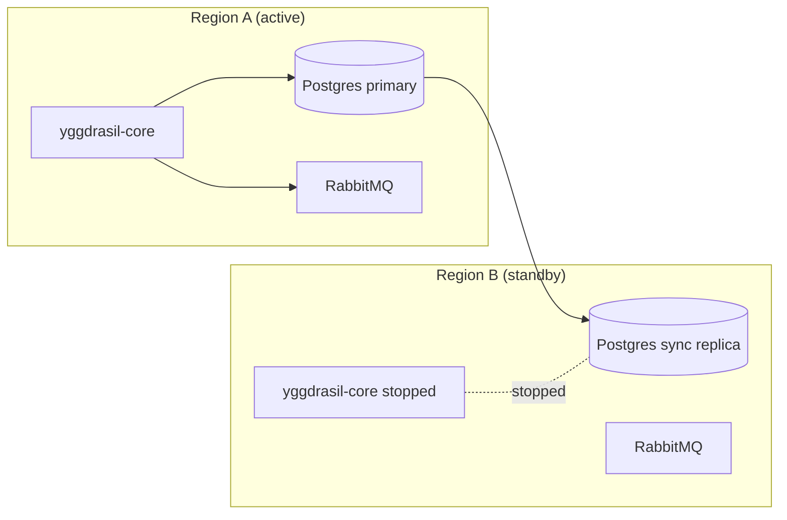

# Disaster recovery

Scenarios that are worse than "restore last night's backup". The
playbook here covers full region loss, complete data corruption, key
compromise, and the sideways situation where *Yggdrasil itself* is
broken but the business still needs the platform to operate.

## DR tiers and what each costs

| Scenario | Likelihood | RPO target | RTO target | Cost |
|---|---|---|---|---|
| Full region loss | Low (<1%/yr) | < 5 min | < 1 h | Cross-region sync replica + cold standby core |
| Encryption key compromise | Low | 0 min (no data loss, but rotate) | < 4 h | Rotation playbook + re-encryption workflow |
| Postgres corruption | Rare | ≤ 1 h (PITR) | < 2 h | PITR + tested restore |
| Message broker loss *(when `transport: rabbitmq` is used)* | Uncommon | 0 min (stateless) | < 15 min | Redundant broker or managed RMQ. Not applicable to pure HTTP deployments. |
| Ransomware / mass manifest deletion | Rare but bad | ≤ 1 h | < 2 h | Immutable off-site backups + write throttle |
| Adapter compromise (one integration) | Depends | 0 min | < 30 min | Isolate, rotate creds, redeploy |

Define the targets for your deployment tier, then pick the tools
that meet them. No DR plan without concrete numbers.

## Region loss

### Topology

Postgres streaming replication (synchronous or near-sync) keeps B
ready. RMQ is stateless; you can re-declare queues on B when the
core fails over.

### Failover procedure

1. **Confirm region A is down.** Use your cloud's status + internal
   health checks; don't failover on a network blip.
2. **Promote B's Postgres** to primary. Managed-DB UI or
   `pg_ctl promote`.
3. **Rotate the `DB_HOST`** config for the core pods in B to point
   at the newly promoted DB.
4. **Scale up region B's core** (`kubectl scale --replicas=3`).
   Wait for `/readyz`.
5. **Adapters reconnect** autonomously (the broker URL is either
   global or regional per your topology).
6. **DNS / LB cutover** to region B.
7. **Announce** via your incident channels. The RTO target is from
   "decided to failover" to this step.

### Failback procedure

Careful — B is now the source of truth. Don't just reattach A as
primary.

1. Rebuild region A's Postgres as a *replica* of B.
2. When caught up, plan a maintenance window.
3. Stop writes on B, let A's replica catch up fully, fail back.

## Encryption key compromise

Managed secrets are encrypted with a single master key. If it leaks,
every secret is potentially compromised; rotate both the key and
every secret.

### Playbook

1. **Rotate the master key** in your key store. The core reads it
   from env; restart pods with the new env.
2. **Re-encrypt** existing `managed_secret` rows with the new key.
   A migration workflow using
   [integration-secrets-management](https://github.com/dakasa-yggdrasil/integration-secrets-management)
   can iterate rows, decrypt with old key, re-encrypt with new,
   write back.
3. **Rotate every backed secret**:
   - For secrets that mirror upstream (AWS Secrets Manager, GCP
     Secret Manager): trigger upstream rotation.
   - For secrets owned in-core: issue new values via the
     integration that owns them (regenerate API keys, rotate
     cluster creds, etc).
4. **Audit reads**. The `event_log` stream has `secret.read` entries
   for the window before rotation; review for suspicious consumers.

The re-encryption + secret rotation typically takes hours for a
large catalog. Plan accordingly; the RTO is a function of how many
secrets you have.

## Postgres corruption

Point-in-time recovery to a moment before the corruption. Your
managed DB provider makes this a button click — assuming you've
configured PITR retention wide enough to cover the corruption
window.

If PITR is not enabled (don't do that), restore from the nightly
backup and accept the RPO hit.

## Message broker loss

Applies only when any integration uses `transport: rabbitmq`.
HTTP-only deployments skip this section.

Stateless by design. If the broker is completely gone:

1. Stand up a fresh cluster.
2. Update `BROKER_URL` on the core and all AMQP adapters.
3. Adapters re-declare their queues on reconnect.
4. AMQP-transport workflow steps that were in-flight during the
   outage are lost — they appear in `workflow_run` as
   `status: running` forever. Run a one-time cleanup workflow that
   marks them `failed` with `error: "broker outage"`.
5. HTTP-transport integrations are unaffected.

## Ransomware / mass deletion

The scenario: somebody (an attacker, a bug, a script run with too
broad a token) deletes or corrupts hundreds of manifests in one
hour.

### Prevention

- **Off-site immutable backups** (S3 Object Lock, GCS retention
  policies). Attackers can't delete what they can't reach.
- **RBAC scopes** on automation tokens. No human-style token should
  be able to `manifest.delete` at will.
- **Rate-limit policy** on destructive actions. A policy rule that
  denies > 10 deletes in a single session forces an operator to
  pause.

### Response

1. Freeze writes: revoke the compromised token, scale the core to
   `readOnly` mode (set `YGGDRASIL_READ_ONLY=true` env var — planned
   feature; today, isolate via network policy).
2. Identify the blast radius from `event_log` (`manifest.deleted`
   + `manifest.created` unusual patterns).
3. Restore the deleted manifests by re-applying prior versions from
   `manifest_version` (they're still there — delete just tombstones
   the active pointer).
4. Rotate the compromised token; reassess RBAC scoping.
5. Postmortem + adjust guardrails.

The good news: versioned manifests mean "undelete" is just
"re-apply the previous version".

## Adapter compromise

One integration adapter is compromised (a container exploit, a
credential leak, a supply-chain attack on the adapter image).

1. **Isolate** — drain the adapter's pods, stop new AMQP deliveries.
2. **Identify** — what did the adapter's credentials grant? The
   `integration_instance` manifest tells you.
3. **Rotate those credentials** upstream.
4. **Rebuild** the adapter image from source, re-deploy from a
   trusted registry.
5. **Audit** the `event_log` for `integration.executed` events by
   that instance during the compromise window.
6. **Postmortem** — how did the compromise happen? Image supply
   chain? Runtime exploit? Over-scoped IAM policy?

The blast radius is bounded to what the single compromised
adapter's credentials could do. Managed secrets mean other
adapters stay safe.

## DR drills

Run one real DR drill per quarter. Minimum drill set:

- **Restore drill** (monthly) — from the backup-restore runbook.
- **Regional failover** (quarterly) — promote the standby, cut over
  LB, verify, fail back.
- **Key rotation** (quarterly) — rotate the encryption key against
  a non-prod environment, measure how long re-encryption takes, use
  the result to calibrate the prod RTO.
- **Token compromise** (annually) — simulate a leaked CI token and
  practice the containment playbook.

Document outcomes in a `yggdrasil-dr-drill-YYYY-MM-DD` manifest
(kind: `incident_postmortem` or your custom kind). Platform eats its
own dog food.

## The single-best investment

If you can only do one thing: **automate the restore**. A scripted
restore that runs monthly against a scratch environment eliminates
95% of disaster-time panic. The other 5% is practice.
