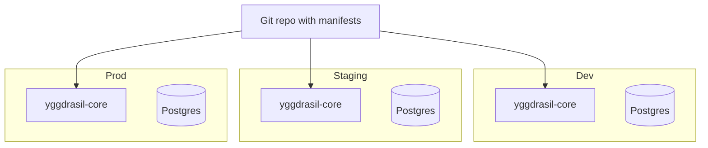

# Multi-environment

Dev, staging, prod — and tenant-A, tenant-B — as you grow. This page
lays out the three patterns, with trade-offs.

## Pattern 1: namespace-based (single core)

One Yggdrasil core, one Postgres, one RabbitMQ. Environments are
namespaces.

```
global
├── platform-bases         (shared integration_types)
prod
├── workflows, instances, secrets...
staging
├── workflows, instances, secrets...
dev
├── workflows, instances, secrets...
```

### When to choose

- Small org, < 20 operators total.
- All environments share the same blast radius for infra
  (Postgres/RMQ).
- RBAC is enough for access isolation.

### Properties

- **Cheap** — one set of infra to run.
- **Simple promotion** — `yggdrasil get workflow -n staging -o yaml >
  /tmp/w.yaml; sed 's/staging/prod/' /tmp/w.yaml | yggdrasil apply
  -f -`.
- **Coupled failure mode** — a bad manifest in dev that crashes an
  adapter loop also poisons prod. Policy + RBAC help, but the infra
  is shared.

### RBAC sketch

```yaml
roles:
  - name: prod-admin
    rules:
      - { effect: allow, resources: ["manifest.prod.*"], actions: ["*"] }
  - name: dev-operator
    rules:
      - { effect: allow, resources: ["manifest.dev.*"], actions: ["*"] }

bindings:
  - name: prod-team
    subjects: [{ type: team, id: platform-prod }]
    roles:   [prod-admin]
  - name: dev-team
    subjects: [{ type: team, id: engineering }]
    roles:   [dev-operator]
```

Namespaces in the resource string keep access scoped.

## Pattern 2: separate core per environment

Three Yggdrasil cores — dev, staging, prod — each with its own
Postgres and RMQ.



### When to choose

- Compliance requires environment isolation (SOC2, PCI, HIPAA).
- Environments have materially different uptime requirements.
- Promotion between environments is explicit (git commit + CD
  pipeline hits each core separately).

### Properties

- **Strong isolation** — a bad dev deploy cannot reach prod.
- **3× infra** cost and complexity.
- **Requires a GitOps promotion pattern** — manifests live in a
  repo, each env consumes its own directory via
  `yggdrasil apply -f` in a CI job.
- **Three CLI contexts** to juggle; nothing the kubectl-style
  `~/.yggdrasil/config.yaml` doesn't handle, but operators have to
  remember the context.

### CLI context setup

```yaml
# ~/.yggdrasil/config.yaml
current_context: prod
contexts:
  dev:     { server: https://dev.yggdrasil.example.com,     token: ... }
  staging: { server: https://staging.yggdrasil.example.com, token: ... }
  prod:    { server: https://prod.yggdrasil.example.com,    token: ... }
```

`YGGDRASIL_CONTEXT=staging yggdrasil get workflow` for one-off
context switches.

## Pattern 3: multi-tenant (multiple cores, one per tenant)

Each customer / business unit / team gets their own core. Manifests
are fully isolated; Yggdrasil itself is part of the tenancy boundary.

### When to choose

- You're running Yggdrasil as part of a commercial offering and need
  hard isolation between customers.
- Regulatory requirement that tenant X's data never share a DB with
  tenant Y.
- Each tenant has a different scale profile (one tenant at 1M runs/
  day, another at 100).

### Properties

- **Hard isolation**. Tenant's catalog, events, secrets, sessions —
  all in separate Postgres/RMQ/core.
- **Operationally heavy** — N deployments to upgrade, monitor,
  back up. Automation essential; do not attempt at scale without it.
- **Federation layer** (optional). A meta-service that reads from
  all tenant cores' `/api/v1/integration-catalog` to present a
  global view. Read-only. Writes stay per-tenant.

### Automation essentials

- Each tenant provisioned via a Yggdrasil workflow (dogfood). Input:
  tenant id, Helm values overrides. Output: the tenant's
  `yggdrasil-core` running, admin credentials delivered to a secure
  channel.
- Upgrade is a workflow that iterates tenants, applies the new
  chart, waits for `/readyz`. Canary pattern — upgrade 10% of
  tenants, bake, expand.

## Promotion across environments

Regardless of pattern, the promotion flow is manifest-centric:

1. **Write manifests in git.** `manifests/dev/`, `manifests/staging/`,
   `manifests/prod/`. Often with a shared `manifests/base/` that
   each env overlays (kustomize-style, or via templates).
2. **CI applies** on merge to main. Three CI jobs, one per env, each
   with its own Yggdrasil token. `yggdrasil apply -f manifests/<env>
   -R` where `-R` is a future recursive flag; today, loop over the
   files.
3. **Test after apply.** CI smoke: `yggdrasil logs <run-id>` after a
   promotion workflow that exercises the pipeline.
4. **Roll back** by reverting the git commit and re-applying. Since
   manifests are versioned in Yggdrasil, you get both git history
   *and* Yggdrasil history — belt and suspenders.

## Shared integration catalog

Common in pattern 1 (same namespace `global` in one core) and
tricky in pattern 2/3.

| Pattern | How shared integrations happen |
|---|---|
| 1 | `global` namespace holds `integration_family` + `integration_type`; per-env namespace holds `integration_instance`. |
| 2 | Apply the same `integration_family` / `integration_type` manifests to each core (identical YAML, just pointed at each env's Yggdrasil). |
| 3 | Each tenant applies their own integration_types from a curated catalog repo the vendor maintains. |

Don't try to sync integration_instances across envs — they carry
env-specific credentials.

## The right choice

Start with **pattern 1**. Most teams stay there forever. Move to
pattern 2 only when you have a concrete reason (compliance,
uptime differential, blast radius concern). Move to pattern 3 only
if Yggdrasil is itself a commercial multi-tenant offering.

Don't over-engineer day one.
